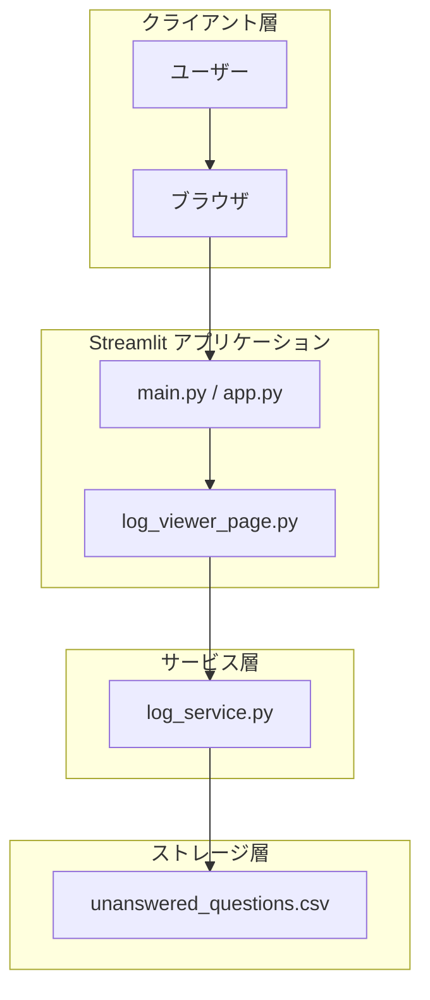
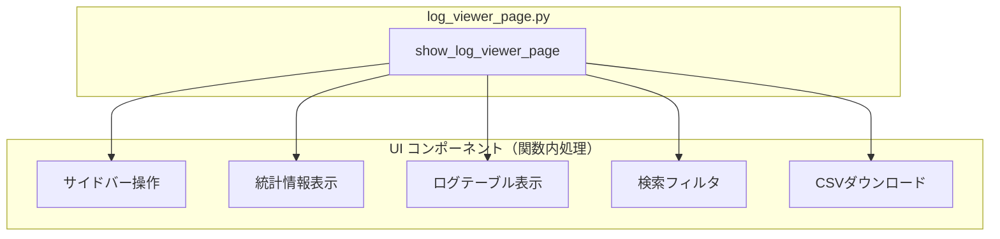
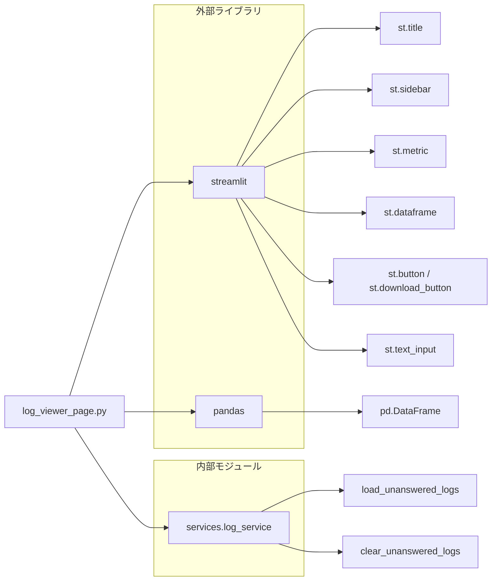

# log_viewer_page.py - 未回答ログ閲覧ページ ドキュメント

**Version 1.0** | 最終更新: 2025-01-29

---

## 目次

1. [概要](#概要)
2. [アーキテクチャ構成図](#1-アーキテクチャ構成図)
3. [モジュール構成図](#2-モジュール構成図)
4. [クラス・関数一覧表](#3-クラス関数一覧表)
5. [クラス・関数 IPO詳細](#4-クラス関数-ipo詳細)
6. [使用例](#5-使用例)
7. [変更履歴](#6-変更履歴)
8. [付録: 依存関係図](#付録-依存関係図)

---

## 概要

`log_viewer_page.py`は、RAGエージェントが回答できなかった質問のログを表示・管理するStreamlitページモジュール。ナレッジベースの拡充に向けた分析・改善のための情報を提供する。

### 主な責務

- 未回答質問ログの一覧表示
- ログデータの統計情報表示（件数、最多理由）
- テキストによるログ検索・フィルタリング
- ログデータのCSVエクスポート
- ログの全消去機能

### 主要機能一覧

| 機能 | 説明 |
|------|------|
| `show_log_viewer_page()` | 未回答ログ閲覧画面を表示するメイン関数 |

---

## 1. アーキテクチャ構成図

### 1.1 システム全体構成



### 1.2 データフロー

1. ユーザーがブラウザで未回答ログ閲覧ページにアクセス
2. `show_log_viewer_page()`が`log_service`を通じてCSVログを読み込み
3. DataFrameとして統計情報・一覧をStreamlit UIで表示
4. ユーザー操作（検索、ダウンロード、消去）に応じてUIを更新

---

## 2. モジュール構成図

### 2.1 内部モジュール構成



### 2.2 外部依存関係

| ライブラリ | バージョン | 用途 |
|-----------|-----------|------|
| `streamlit` | - | WebUI フレームワーク |
| `pandas` | - | データフレーム操作・CSV変換 |

### 2.3 内部依存モジュール

| モジュール | 用途 |
|-----------|------|
| `services.log_service.load_unanswered_logs` | 未回答ログの読み込み |
| `services.log_service.clear_unanswered_logs` | 未回答ログの消去 |

---

## 3. クラス・関数一覧表

### 3.1 関数一覧

#### ページ表示関数

| 関数名 | 概要 |
|-------|------|
| `show_log_viewer_page()` | 未回答ログ閲覧画面のメイン関数 |

---

## 4. クラス・関数 IPO詳細

### 4.1 ページ表示関数

#### `show_log_viewer_page`

**概要**: エージェントが回答できなかった質問のログを表示・管理する画面を描画する。

```python
def show_log_viewer_page() -> None
```

| パラメータ | 型 | デフォルト | 説明 |
|------------|------|-----------|------|
| - | - | - | パラメータなし |

| 項目 | 内容 |
|------|------|
| **Input** | なし |
| **Process** | 1. `load_unanswered_logs()`でログデータを読み込み<br>2. サイドバーに操作ボタン（最新取得、全消去）を表示<br>3. ログが空の場合は情報メッセージを表示して終了<br>4. 統計情報（未回答数、最多理由）をメトリクス表示<br>5. 検索フィルタでDataFrameを絞り込み<br>6. `st.dataframe()`でログ一覧を表示<br>7. CSVダウンロードボタンを提供 |
| **Output** | `None`（画面描画のみ） |

**UI構成**:

| エリア | コンポーネント | 機能 |
|--------|---------------|------|
| タイトル | `st.title()` | ページタイトル表示 |
| サイドバー | `st.button("🔄 最新情報を取得")` | `st.rerun()`で画面再読込 |
| サイドバー | `st.button("🗑️ ログを全消去")` | `clear_unanswered_logs()`を呼び出し |
| メイン | `st.metric()` x 2 | 未回答数、最多理由の表示 |
| メイン | `st.text_input()` | ログ検索フィルタ |
| メイン | `st.dataframe()` | ログ一覧テーブル |
| メイン | `st.download_button()` | CSV形式でダウンロード |

**カラム設定**:

| カラム名 | 設定 | 説明 |
|---------|------|------|
| `timestamp` | `DatetimeColumn` | 日時（YYYY-MM-DD HH:mm:ss形式） |
| `query` | `TextColumn` (large) | 質問内容 |
| `collections` | デフォルト | 検索コレクション |
| `reason` | デフォルト | 未回答理由 |
| `agent_response` | デフォルト | エージェント応答 |

```python
# 使用例（Streamlit アプリから呼び出し）
import streamlit as st
from pages.log_viewer_page import show_log_viewer_page

# サイドバーでページ選択後
if selected_page == "未回答ログ":
    show_log_viewer_page()
```

---

## 5. 使用例

### 5.1 基本的なワークフロー

```python
# main.py または app.py からの呼び出し例
import streamlit as st
from pages.log_viewer_page import show_log_viewer_page

# ページ設定
st.set_page_config(page_title="RAG Admin", layout="wide")

# サイドバーでのページ選択
page = st.sidebar.selectbox("ページ選択", ["チャット", "未回答ログ", "設定"])

if page == "未回答ログ":
    show_log_viewer_page()
```

### 5.2 マルチページアプリでの使用

```python
# pages/log_viewer.py（Streamlit マルチページ構成）
from pages.log_viewer_page import show_log_viewer_page

show_log_viewer_page()
```

---

## 6. 変更履歴

| バージョン | 変更内容 |
|-----------|---------|
| 1.0 | 初版作成 |

---

## 付録: 依存関係図



---

## 不足情報・確認事項

> 📝 **注意**: 以下の情報が不足しているため、確認・補完が必要です。

| 項目 | 現状 | 確認事項 |
|------|------|---------|
| バージョン情報 | 仮で1.0を設定 | 正式なバージョン番号があれば指定 |
| `config.PathConfig` | `log_service.py`でインポートされているが未使用 | 将来的な利用予定の有無 |
| エラーハンドリング | 明示的なtry-exceptなし | ログサービスのエラーがUI側で処理されるか確認 |
| アクセス制御 | 記載なし | 認証・認可の要件があるか確認 |
| ページ配置パス | `pages/`を想定 | 実際のディレクトリ構造を確認 |
| 親アプリケーション | `main.py / app.py`を想定 | 実際のエントリポイント名を確認 |
