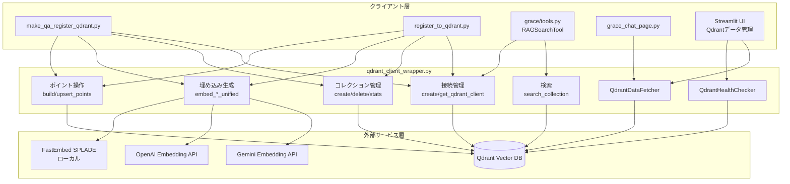
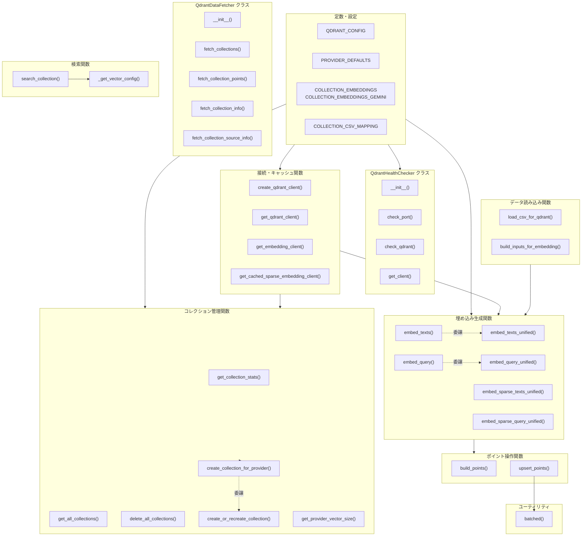
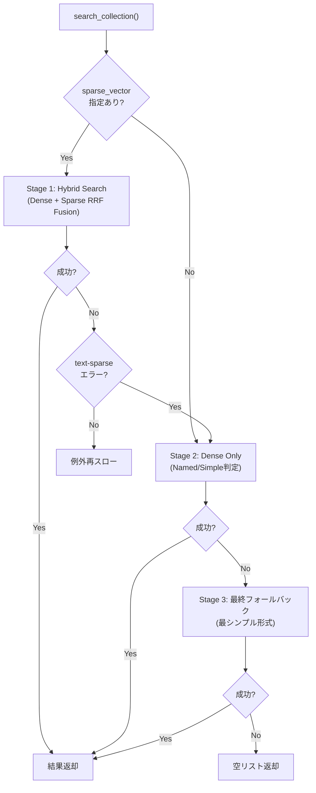
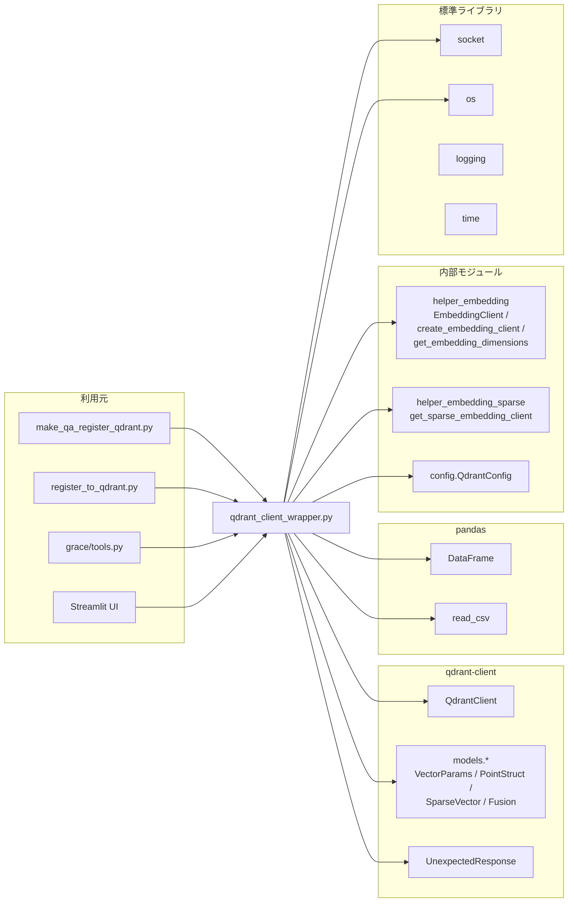

# qdrant_client_wrapper.py - Qdrant操作ユーティリティ ドキュメント

**Version 1.0** | 最終更新: 2026-02-15

---

## 目次

1. [概要](#概要)
2. [アーキテクチャ構成図](#1-アーキテクチャ構成図)
3. [モジュール構成図](#2-モジュール構成図)
4. [クラス・関数一覧表](#3-クラス関数一覧表)
5. [クラス・関数 IPO詳細](#4-クラス関数-ipo詳細)
6. [設定・定数](#5-設定定数)
7. [使用例](#6-使用例)
8. [エクスポート](#7-エクスポート)
9. [変更履歴](#8-変更履歴)
10. [付録: 依存関係図](#付録-依存関係図)

---

## 概要

`qdrant_client_wrapper.py`は、Qdrantベクトルデータベースとの操作を一元管理するユーティリティモジュールです。接続管理、コレクション操作、埋め込み生成（Dense / Sparse）、ポイント構築・登録、検索（Dense / Hybrid）の全機能を単一モジュールで提供します。Gemini 3 Migration により、OpenAI・Gemini・FastEmbed の3プロバイダーに対応した埋め込み抽象化レイヤーを備えます。

### 主な責務

- Qdrantサーバーへの接続管理とヘルスチェック
- コレクションの作成・削除・統計情報取得
- 埋め込みベクトル生成（Dense: Gemini/OpenAI、Sparse: SPLADE）
- ポイント構築・バッチアップサート
- コレクション検索（Dense / Hybrid の3段階フォールバック）
- コレクションデータの取得・DataFrame変換

### 各責務対応のモジュール

| # | 責務 | 対応モジュール | 説明 |
|---|------|--------------|------|
| 1 | 接続管理とヘルスチェック | `qdrant_client_wrapper.py` | `QdrantHealthChecker` クラス + シングルトン管理関数 |
| 2 | コレクション操作 | `qdrant_client_wrapper.py` | `create_or_recreate_collection()` 等のコレクション管理関数群 |
| 3 | 埋め込みベクトル生成 | `helper_embedding.py`, `helper_embedding_sparse.py` | 抽象化レイヤー。本モジュールはキャッシュ付きラッパーを提供 |
| 4 | ポイント構築・登録 | `qdrant_client_wrapper.py` | `build_points()`, `upsert_points()` |
| 5 | 検索（Dense / Hybrid） | `qdrant_client_wrapper.py` | `search_collection()` の3段階フォールバック |
| 6 | データ取得・DataFrame変換 | `qdrant_client_wrapper.py` | `QdrantDataFetcher` クラス |

### 主要機能一覧

| 機能 | 説明 |
|------|------|
| `QdrantHealthChecker` | Qdrantサーバーの接続状態チェック |
| `QdrantHealthChecker.check_qdrant()` | ポート確認 + API接続テスト + メトリクス取得 |
| `QdrantDataFetcher` | Qdrantからデータを取得しDataFrame化 |
| `QdrantDataFetcher.fetch_collections()` | 全コレクション一覧をDataFrameで取得 |
| `QdrantDataFetcher.fetch_collection_points()` | コレクション内ポイントをDataFrameで取得 |
| `QdrantDataFetcher.fetch_collection_info()` | コレクション詳細情報を辞書で取得 |
| `QdrantDataFetcher.fetch_collection_source_info()` | データソース別統計を推定取得 |
| `create_qdrant_client()` | QdrantClientインスタンスを作成 |
| `get_qdrant_client()` | シングルトンQdrantClientを取得 |
| `get_embedding_client()` | キャッシュ済みEmbeddingClientを取得 |
| `get_cached_sparse_embedding_client()` | キャッシュ済みSparse EmbeddingClientを取得 |
| `get_collection_stats()` | コレクション統計情報を取得 |
| `get_all_collections()` | 全コレクション情報をリストで取得 |
| `delete_all_collections()` | 全コレクションを削除（除外指定可） |
| `create_or_recreate_collection()` | コレクション作成（Dense + Sparse対応） |
| `load_csv_for_qdrant()` | CSVをQdrant登録用DataFrameにロード |
| `build_inputs_for_embedding()` | DataFrameから埋め込み入力テキストを構築 |
| `embed_texts()` | テキストをDense Embeddingに変換（レガシー） |
| `embed_query()` | クエリをDense Embeddingに変換（レガシー） |
| `embed_texts_unified()` | テキストをDense Embeddingに変換（プロバイダー抽象化版） |
| `embed_query_unified()` | クエリをDense Embeddingに変換（プロバイダー抽象化版） |
| `embed_sparse_texts_unified()` | テキストをSparse Embeddingに変換 |
| `embed_sparse_query_unified()` | クエリをSparse Embeddingに変換 |
| `create_collection_for_provider()` | プロバイダーに応じた次元数でコレクション作成 |
| `get_provider_vector_size()` | プロバイダーのデフォルト次元数を取得 |
| `build_points()` | DataFrame + ベクトルからQdrantポイントを構築 |
| `upsert_points()` | ポイントをバッチでQdrantにアップサート |
| `search_collection()` | 3段階フォールバック付き検索（Hybrid → Dense → Simple） |
| `batched()` | イテラブルをバッチに分割するユーティリティ |

---

## 1. アーキテクチャ構成図

### 1.1 システム全体構成



### 1.2 データフロー

1. クライアント層が `create_qdrant_client()` または `get_qdrant_client()` で接続を取得
2. `create_or_recreate_collection()` でコレクションを作成（Dense + Sparse ベクトル設定）
3. `load_csv_for_qdrant()` でCSVデータをDataFrameにロード
4. `embed_texts_unified()` でテキストを埋め込みベクトルに変換（プロバイダー自動選択）
5. `build_points()` でDataFrame + ベクトルからQdrantポイントを構築
6. `upsert_points()` でバッチアップサート
7. `search_collection()` で3段階フォールバック検索（Hybrid → Dense → Simple）
8. `QdrantDataFetcher` で登録済みデータをDataFrameとして取得

---

## 2. モジュール構成図

### 2.1 内部モジュール構成



### 2.2 外部依存関係

| ライブラリ | バージョン | 用途 |
|-----------|-----------|------|
| `qdrant-client` | >= 1.7 | Qdrant Vector DB クライアント |
| `pandas` | >= 1.5 | DataFrame操作（CSV読み込み、データ変換） |
| `tiktoken` | >= 0.5 | トークンカウント（間接利用） |

### 2.3 内部依存モジュール

| モジュール | 用途 |
|-----------|------|
| `helper.helper_embedding` | `EmbeddingClient` 抽象基底クラス、`create_embedding_client()`, `get_embedding_dimensions()` |
| `helper.helper_embedding_sparse` | `get_sparse_embedding_client()` — Sparse Embedding (SPLADE) 生成 |
| `config.QdrantConfig` | Qdrant接続設定（HOST, PORT, URL, DEFAULT_TIMEOUT 等）。ImportError時はフォールバック定義を使用 |

---

## 3. クラス・関数一覧表

### 3.1 クラス一覧

#### QdrantHealthChecker

| メソッド | 概要 |
|---------|------|
| `__init__(debug_mode)` | コンストラクタ（デバッグモード指定） |
| `check_port(host, port, timeout)` | TCP ポートの開閉チェック |
| `check_qdrant()` | Qdrant接続テスト + メトリクス取得 |
| `get_client()` | 接続済みクライアントを取得 |

#### QdrantDataFetcher

| メソッド | 概要 |
|---------|------|
| `__init__(client)` | コンストラクタ（QdrantClient指定） |
| `fetch_collections()` | 全コレクション一覧をDataFrameで取得 |
| `fetch_collection_points(collection_name, limit)` | コレクション内ポイントをDataFrameで取得 |
| `fetch_collection_info(collection_name)` | コレクション詳細情報を辞書で取得 |
| `fetch_collection_source_info(collection_name, sample_size)` | データソース別統計を推定取得 |

### 3.2 関数一覧（カテゴリ別）

#### ユーティリティ

| 関数名 | 概要 |
|-------|------|
| `batched(seq, size)` | イテラブルをバッチサイズごとに分割 |

#### 接続・キャッシュ管理

| 関数名 | 概要 |
|-------|------|
| `create_qdrant_client(url, timeout)` | QdrantClientインスタンスを新規作成 |
| `get_qdrant_client()` | シングルトンQdrantClientを取得 |
| `get_embedding_client(provider)` | キャッシュ済みEmbeddingClientを取得 |
| `get_cached_sparse_embedding_client(model_name)` | キャッシュ済みSparse EmbeddingClientを取得 |

#### コレクション管理

| 関数名 | 概要 |
|-------|------|
| `get_collection_stats(client, collection_name)` | コレクション統計情報を取得 |
| `get_all_collections(client)` | 全コレクション情報をリストで取得 |
| `delete_all_collections(client, excluded)` | 全コレクション削除（除外指定可） |
| `create_or_recreate_collection(client, name, recreate, vector_size, use_sparse)` | コレクション作成 / 再作成 |
| `create_collection_for_provider(client, name, provider, recreate, use_sparse)` | プロバイダー自動判定でコレクション作成 |
| `get_provider_vector_size(provider)` | プロバイダーのデフォルト次元数を取得 |

#### データ読み込み

| 関数名 | 概要 |
|-------|------|
| `load_csv_for_qdrant(path, required, limit)` | CSVをQdrant登録用DataFrameにロード |
| `build_inputs_for_embedding(df, include_answer)` | DataFrameから埋め込み入力テキストを構築 |

#### 埋め込み生成（レガシー）

| 関数名 | 概要 |
|-------|------|
| `embed_texts(texts, model, batch_size)` | テキストをDense Embeddingに変換（内部で`embed_texts_unified`に委譲） |
| `embed_query(text, model, dims)` | クエリをDense Embeddingに変換（内部で`embed_query_unified`に委譲） |

#### 埋め込み生成（Unified — Gemini 3 Migration）

| 関数名 | 概要 |
|-------|------|
| `embed_texts_unified(texts, provider, batch_size)` | テキストをDense Embeddingに変換（プロバイダー抽象化版） |
| `embed_query_unified(text, provider)` | クエリをDense Embeddingに変換（プロバイダー抽象化版） |
| `embed_sparse_texts_unified(texts, model_name, batch_size, progress_callback)` | テキストをSparse Embeddingに変換 |
| `embed_sparse_query_unified(text, model_name)` | クエリをSparse Embeddingに変換 |

#### ポイント操作

| 関数名 | 概要 |
|-------|------|
| `build_points(df, vectors, domain, source_file)` | DataFrame + ベクトルからQdrantポイントを構築 |
| `upsert_points(client, collection, points, batch_size)` | ポイントをバッチでアップサート |

#### 検索

| 関数名 | 概要 |
|-------|------|
| `_get_vector_config(client, collection_name)` | ベクトル設定をキャッシュ付きで取得（内部関数） |
| `search_collection(client, collection_name, query_vector, sparse_vector, limit, hybrid_alpha)` | 3段階フォールバック検索 |

---

## 4. クラス・関数 IPO詳細

### 4.1 QdrantHealthChecker クラス

Qdrantサーバーの接続状態をチェックし、メトリクス（コレクション数、応答時間等）を取得するクラスです。

#### コンストラクタ: `__init__`

**概要**: ヘルスチェッカーを初期化します。

```python
QdrantHealthChecker(debug_mode: bool = False)
```

| パラメータ | 型 | デフォルト | 説明 |
|------------|------|-----------|------|
| `debug_mode` | bool | False | True の場合、エラー時にスタックトレースをログ出力 |

| 項目 | 内容 |
|------|------|
| **Input** | `debug_mode: bool = False` |
| **Process** | `self.debug_mode` と `self.client = None` を設定 |
| **Output** | QdrantHealthCheckerインスタンス |

```python
# 使用例
checker = QdrantHealthChecker(debug_mode=True)
```

#### メソッド: `check_port`

**概要**: 指定ホスト・ポートがTCP接続可能かチェックします。

```python
def check_port(self, host: str, port: int, timeout: float = 2.0) -> bool
```

| パラメータ | 型 | デフォルト | 説明 |
|------------|------|-----------|------|
| `host` | str | - | ホスト名 |
| `port` | int | - | ポート番号 |
| `timeout` | float | 2.0 | タイムアウト秒数 |

| 項目 | 内容 |
|------|------|
| **Input** | `host: str`, `port: int`, `timeout: float = 2.0` |
| **Process** | 1. TCPソケットを作成<br>2. タイムアウトを設定<br>3. `connect_ex()` で接続試行<br>4. 結果が 0 なら True |
| **Output** | `bool`: ポートが開いている場合 True |

```python
# 使用例
checker = QdrantHealthChecker()
is_open = checker.check_port("localhost", 6333)
# 結果: True
```

#### メソッド: `check_qdrant`

**概要**: Qdrantサーバーへの接続テストを行い、メトリクスを返します。

```python
def check_qdrant(self) -> Tuple[bool, str, Optional[Dict]]
```

| パラメータ | 型 | デフォルト | 説明 |
|------------|------|-----------|------|
| なし（selfのみ） | - | - | - |

| 項目 | 内容 |
|------|------|
| **Input** | なし（selfのみ） |
| **Process** | 1. `check_port()` でポート開放を確認<br>2. QdrantClient を作成して `get_collections()` を呼び出し<br>3. コレクション数・名前・応答時間をメトリクスとして返却 |
| **Output** | `Tuple[bool, str, Optional[Dict]]`<br>- bool: 接続成功フラグ<br>- str: メッセージ（"Connected" or エラー内容）<br>- Dict: メトリクス（collection_count, collections, response_time_ms） |

**戻り値例**:
```python
# 成功時
(True, "Connected", {
    "collection_count": 3,
    "collections": ["wikipedia_ja_5per", "cc_news_1per", "livedoor_1per"],
    "response_time_ms": 12.34
})

# 失敗時
(False, "Connection refused (port closed)", None)
```

```python
# 使用例
checker = QdrantHealthChecker()
ok, msg, metrics = checker.check_qdrant()
if ok:
    print(f"接続成功: {metrics['collection_count']}コレクション")
```

#### メソッド: `get_client`

**概要**: `check_qdrant()` で接続済みの QdrantClient を取得します。

```python
def get_client(self) -> Optional[QdrantClient]
```

| 項目 | 内容 |
|------|------|
| **Input** | なし（selfのみ） |
| **Process** | `self.client` を返却 |
| **Output** | `Optional[QdrantClient]`: 接続済みクライアント。未接続時は None |

---

### 4.2 QdrantDataFetcher クラス

Qdrantからデータを取得し、pandas DataFrameに変換するクラスです。Streamlit UIでのデータ表示に使用されます。

#### コンストラクタ: `__init__`

**概要**: QdrantClientを受け取り、データ取得クラスを初期化します。

```python
QdrantDataFetcher(client: QdrantClient)
```

| パラメータ | 型 | デフォルト | 説明 |
|------------|------|-----------|------|
| `client` | QdrantClient | - | Qdrantクライアントインスタンス |

| 項目 | 内容 |
|------|------|
| **Input** | `client: QdrantClient` |
| **Process** | `self.client` を設定 |
| **Output** | QdrantDataFetcherインスタンス |

#### メソッド: `fetch_collections`

**概要**: 全コレクションの一覧情報をDataFrameで取得します。

```python
def fetch_collections(self) -> pd.DataFrame
```

| 項目 | 内容 |
|------|------|
| **Input** | なし（selfのみ） |
| **Process** | 1. `get_collections()` で全コレクション名を取得<br>2. 各コレクションの `get_collection()` でベクトル数・ポイント数・ステータスを取得<br>3. DataFrameに変換して返却 |
| **Output** | `pd.DataFrame`: カラム = Collection, Vectors Count, Points Count, Indexed Vectors, Status |

**戻り値例**:
```python
#    Collection         Vectors Count  Points Count  Indexed Vectors  Status
# 0  wikipedia_ja_5per  1500           1500          1500             green
# 1  cc_news_1per       300            300           300              green
```

```python
# 使用例
client = get_qdrant_client()
fetcher = QdrantDataFetcher(client)
df = fetcher.fetch_collections()
print(df)
```

#### メソッド: `fetch_collection_points`

**概要**: コレクション内のポイント（ペイロード）をDataFrameで取得します。

```python
def fetch_collection_points(self, collection_name: str, limit: int = 50) -> pd.DataFrame
```

| パラメータ | 型 | デフォルト | 説明 |
|------------|------|-----------|------|
| `collection_name` | str | - | コレクション名 |
| `limit` | int | 50 | 取得するポイント数の上限 |

| 項目 | 内容 |
|------|------|
| **Input** | `collection_name: str`, `limit: int = 50` |
| **Process** | 1. `client.scroll()` でポイントを取得<br>2. 各ポイントのペイロードフィールドを列として展開<br>3. 200文字超の文字列は切り詰め |
| **Output** | `pd.DataFrame`: ID列 + ペイロード各フィールドの列 |

```python
# 使用例
df = fetcher.fetch_collection_points("wikipedia_ja_5per", limit=10)
print(df[["ID", "question", "answer"]].head())
```

#### メソッド: `fetch_collection_info`

**概要**: コレクションの詳細情報（ベクトル数、距離関数、ステータス等）を辞書で取得します。

```python
def fetch_collection_info(self, collection_name: str) -> Dict[str, Any]
```

| パラメータ | 型 | デフォルト | 説明 |
|------------|------|-----------|------|
| `collection_name` | str | - | コレクション名 |

| 項目 | 内容 |
|------|------|
| **Input** | `collection_name: str` |
| **Process** | 1. `get_collection()` で情報取得<br>2. Named Vectors / Single Vector を判定<br>3. vector_size, distance, status 等を辞書化 |
| **Output** | `Dict[str, Any]`: vectors_count, points_count, indexed_vectors, status, config |

**戻り値例**:
```python
{
    "vectors_count": 1500,
    "points_count": 1500,
    "indexed_vectors": 1500,
    "status": "green",
    "config": {
        "vector_size": 3072,
        "distance": "Cosine"
    }
}
```

#### メソッド: `fetch_collection_source_info`

**概要**: コレクション内のデータソース別統計（source, domain, 推定件数）をサンプリングで推定取得します。

```python
def fetch_collection_source_info(self, collection_name: str, sample_size: int = 200) -> Dict[str, Any]
```

| パラメータ | 型 | デフォルト | 説明 |
|------------|------|-----------|------|
| `collection_name` | str | - | コレクション名 |
| `sample_size` | int | 200 | サンプルサイズ |

| 項目 | 内容 |
|------|------|
| **Input** | `collection_name: str`, `sample_size: int = 200` |
| **Process** | 1. `scroll()` でサンプルポイントを取得<br>2. source, generation_method, domain を集計<br>3. サンプル比率から全体数を推定 |
| **Output** | `Dict[str, Any]`: total_points, sources（ソース別統計）, sample_size |

**戻り値例**:
```python
{
    "total_points": 1500,
    "sources": {
        "wikipedia_ja_chunks.csv": {
            "sample_count": 180,
            "method": "smart_qa",
            "domain": "wikipedia_ja",
            "estimated_total": 1350,
            "percentage": 90.0
        }
    },
    "sample_size": 200
}
```

---

### 4.3 ユーティリティ関数

#### `batched`

**概要**: イテラブルを指定サイズのバッチに分割するジェネレータです。

```python
def batched(seq: Iterable, size: int) -> Generator[List, None, None]
```

| パラメータ | 型 | デフォルト | 説明 |
|------------|------|-----------|------|
| `seq` | Iterable | - | 分割対象のイテラブル |
| `size` | int | - | バッチサイズ |

| 項目 | 内容 |
|------|------|
| **Input** | `seq: Iterable`, `size: int` |
| **Process** | 1. バッファに要素を追加<br>2. バッファがサイズに達したら yield して空にする<br>3. 残りがあれば最後に yield |
| **Output** | `Generator[List]`: バッチリストを順次生成 |

```python
# 使用例
for batch in batched(range(10), 3):
    print(batch)
# 出力: [0,1,2], [3,4,5], [6,7,8], [9]
```

---

### 4.4 接続・キャッシュ管理関数

#### `create_qdrant_client`

**概要**: QdrantClientインスタンスを新規作成します。

```python
def create_qdrant_client(url: str = None, timeout: int = 30) -> QdrantClient
```

| パラメータ | 型 | デフォルト | 説明 |
|------------|------|-----------|------|
| `url` | str | None | QdrantサーバーURL。None の場合 `QDRANT_CONFIG["url"]` を使用 |
| `timeout` | int | 30 | タイムアウト秒数 |

| 項目 | 内容 |
|------|------|
| **Input** | `url: str = None`, `timeout: int = 30` |
| **Process** | URL をデフォルト解決し、QdrantClient を作成 |
| **Output** | `QdrantClient`: 新規インスタンス |

```python
# 使用例
client = create_qdrant_client()
client_custom = create_qdrant_client(url="http://192.168.1.10:6333", timeout=60)
```

#### `get_qdrant_client`

**概要**: QdrantClient のシングルトンインスタンスを取得します。アプリケーション全体で1つの接続プールを共有します。

```python
def get_qdrant_client() -> QdrantClient
```

| 項目 | 内容 |
|------|------|
| **Input** | なし |
| **Process** | 1. グローバル変数 `_qdrant_client` を確認<br>2. None の場合は `QDRANT_CONFIG["url"]` で新規作成しキャッシュ<br>3. キャッシュ済みインスタンスを返却 |
| **Output** | `QdrantClient`: シングルトンインスタンス |

```python
# 使用例
client = get_qdrant_client()  # 初回: 新規作成
client2 = get_qdrant_client()  # 2回目: 同一インスタンス
assert client is client2  # True
```

#### `get_embedding_client`

**概要**: EmbeddingClient のキャッシュ済みインスタンスを取得します。プロバイダーごとに1つのインスタンスを保持します。

```python
def get_embedding_client(provider: str = None) -> EmbeddingClient
```

| パラメータ | 型 | デフォルト | 説明 |
|------------|------|-----------|------|
| `provider` | str | None | `"gemini"` or `"openai"`。None の場合は `DEFAULT_EMBEDDING_PROVIDER` |

| 項目 | 内容 |
|------|------|
| **Input** | `provider: str = None` |
| **Process** | 1. プロバイダーをデフォルト解決<br>2. `_embedding_clients` 辞書にキャッシュがあれば返却<br>3. なければ `create_embedding_client()` で作成しキャッシュ |
| **Output** | `EmbeddingClient`: キャッシュ済みインスタンス |

```python
# 使用例
emb_client = get_embedding_client("gemini")
print(emb_client.dimensions)  # 3072
```

#### `get_cached_sparse_embedding_client`

**概要**: Sparse EmbeddingClient のキャッシュ済みインスタンスを取得します。

```python
def get_cached_sparse_embedding_client(model_name: str = None) -> SparseEmbeddingClient
```

| パラメータ | 型 | デフォルト | 説明 |
|------------|------|-----------|------|
| `model_name` | str | None | Sparse モデル名。None の場合はデフォルト（`prithivida/Splade_PP_en_v1`） |

| 項目 | 内容 |
|------|------|
| **Input** | `model_name: str = None` |
| **Process** | 1. キャッシュキーを `model_name or "_default"` に設定<br>2. キャッシュがあれば返却、なければ `get_sparse_embedding_client()` で作成しキャッシュ |
| **Output** | `SparseEmbeddingClient`: キャッシュ済みインスタンス |

---

### 4.5 コレクション管理関数

#### `get_collection_stats`

**概要**: コレクションの統計情報（ポイント数、ベクトル設定、ステータス）を取得します。

```python
def get_collection_stats(client: QdrantClient, collection_name: str) -> Optional[Dict[str, Any]]
```

| パラメータ | 型 | デフォルト | 説明 |
|------------|------|-----------|------|
| `client` | QdrantClient | - | Qdrantクライアント |
| `collection_name` | str | - | コレクション名 |

| 項目 | 内容 |
|------|------|
| **Input** | `client: QdrantClient`, `collection_name: str` |
| **Process** | 1. `get_collection()` で情報取得<br>2. Named Vectors / Single Vector を判定してベクトル設定を抽出<br>3. コレクション不在時は None を返却 |
| **Output** | `Optional[Dict[str, Any]]`: total_points, vector_config, status。不在時は None |

**戻り値例**:
```python
{
    "total_points": 1500,
    "vector_config": {
        "default": {"size": 3072, "distance": "Cosine"}
    },
    "status": "green"
}
```

#### `get_all_collections`

**概要**: 全コレクションの名前・ポイント数・ステータスをリストで取得します。

```python
def get_all_collections(client: QdrantClient) -> List[Dict[str, Any]]
```

| パラメータ | 型 | デフォルト | 説明 |
|------------|------|-----------|------|
| `client` | QdrantClient | - | Qdrantクライアント |

| 項目 | 内容 |
|------|------|
| **Input** | `client: QdrantClient` |
| **Process** | 1. `get_collections()` で一覧取得<br>2. 各コレクションの `get_collection()` で詳細取得<br>3. エラー時は `status: "unknown"` で返却 |
| **Output** | `List[Dict[str, Any]]`: 各要素に name, points_count, status |

**戻り値例**:
```python
[
    {"name": "wikipedia_ja_5per", "points_count": 1500, "status": "green"},
    {"name": "cc_news_1per", "points_count": 300, "status": "green"}
]
```

#### `delete_all_collections`

**概要**: 全コレクションを削除します。除外リストで特定コレクションを保護できます。

```python
def delete_all_collections(client: QdrantClient, excluded: List[str] = None) -> int
```

| パラメータ | 型 | デフォルト | 説明 |
|------------|------|-----------|------|
| `client` | QdrantClient | - | Qdrantクライアント |
| `excluded` | List[str] | None | 削除から除外するコレクション名リスト |

| 項目 | 内容 |
|------|------|
| **Input** | `client: QdrantClient`, `excluded: List[str] = None` |
| **Process** | 1. `get_all_collections()` で一覧取得<br>2. `excluded` に含まれないコレクションを削除対象に<br>3. 各コレクションを `delete_collection()` で削除 |
| **Output** | `int`: 削除されたコレクション数 |

```python
# 使用例
deleted = delete_all_collections(client, excluded=["wikipedia_ja_5per"])
print(f"{deleted}件削除")
```

#### `create_or_recreate_collection`

**概要**: Qdrantコレクションを作成します。`recreate=True` の場合は既存コレクションを削除してから再作成します。Dense Vector + オプションで Sparse Vector（Hybrid Search用）を設定します。

```python
def create_or_recreate_collection(
    client: QdrantClient,
    name: str,
    recreate: bool = False,
    vector_size: int = DEFAULT_VECTOR_SIZE,
    use_sparse: bool = False
) -> None
```

| パラメータ | 型 | デフォルト | 説明 |
|------------|------|-----------|------|
| `client` | QdrantClient | - | Qdrantクライアント |
| `name` | str | - | コレクション名 |
| `recreate` | bool | False | True の場合、既存を削除して再作成 |
| `vector_size` | int | 3072 | Dense Vector の次元数 |
| `use_sparse` | bool | False | Sparse Vector（`text-sparse`）を有効化 |

| 項目 | 内容 |
|------|------|
| **Input** | `client`, `name`, `recreate`, `vector_size`, `use_sparse` |
| **Process** | 1. Dense Vector設定（Cosine距離）を作成<br>2. `use_sparse=True` の場合、Sparse Vector設定（`text-sparse`）を追加<br>3. `recreate=True`: 削除 → 作成。`False`: 存在しなければ作成<br>4. `domain` フィールドにペイロード索引を作成 |
| **Output** | `None` |

```python
# 使用例
create_or_recreate_collection(
    client, "wikipedia_ja_5per",
    recreate=True, vector_size=3072, use_sparse=True
)
```

#### `create_collection_for_provider`

**概要**: プロバイダー（gemini / openai）に応じた次元数を自動設定してコレクションを作成します。

```python
def create_collection_for_provider(
    client: QdrantClient,
    name: str,
    provider: str = None,
    recreate: bool = False,
    use_sparse: bool = False
) -> None
```

| パラメータ | 型 | デフォルト | 説明 |
|------------|------|-----------|------|
| `client` | QdrantClient | - | Qdrantクライアント |
| `name` | str | - | コレクション名 |
| `provider` | str | None | `"gemini"` or `"openai"`。None の場合はデフォルト |
| `recreate` | bool | False | 再作成フラグ |
| `use_sparse` | bool | False | Sparse Vector を有効化 |

| 項目 | 内容 |
|------|------|
| **Input** | `client`, `name`, `provider`, `recreate`, `use_sparse` |
| **Process** | 1. `get_embedding_dimensions(provider)` で次元数を取得<br>2. `create_or_recreate_collection()` に委譲 |
| **Output** | `None` |

```python
# 使用例（Gemini: 3072次元 + Sparse）
create_collection_for_provider(client, "qa_gemini", provider="gemini", use_sparse=True)
```

#### `get_provider_vector_size`

**概要**: プロバイダーに応じたデフォルトのベクトル次元数を返します。

```python
def get_provider_vector_size(provider: str = None) -> int
```

| パラメータ | 型 | デフォルト | 説明 |
|------------|------|-----------|------|
| `provider` | str | None | `"gemini"` or `"openai"` |

| 項目 | 内容 |
|------|------|
| **Input** | `provider: str = None` |
| **Process** | `get_embedding_dimensions(provider)` に委譲 |
| **Output** | `int`: 次元数（Gemini: 3072, OpenAI: 1536, FastEmbed: 384） |

---

### 4.6 データ読み込み関数

#### `load_csv_for_qdrant`

**概要**: CSVファイルをQdrant登録用のDataFrameにロードします。列名の正規化、必須列チェック、重複排除を行います。

```python
def load_csv_for_qdrant(
    path: str,
    required: tuple = ("question", "answer"),
    limit: int = 0
) -> pd.DataFrame
```

| パラメータ | 型 | デフォルト | 説明 |
|------------|------|-----------|------|
| `path` | str | - | CSVファイルパス |
| `required` | tuple | `("question", "answer")` | 必須カラム名 |
| `limit` | int | 0 | 行数制限（0 = 無制限） |

| 項目 | 内容 |
|------|------|
| **Input** | `path`, `required`, `limit` |
| **Process** | 1. ファイル存在チェック（FileNotFoundError）<br>2. `pd.read_csv()` でロード<br>3. 列名マッピング（Question→question, Response/Answer/correct_answer→answer）<br>4. 必須列チェック（ValueError）<br>5. NaN→空文字、重複排除、行数制限 |
| **Output** | `pd.DataFrame`: 正規化済みDataFrame |

> 📝 **注意**: 列名マッピングにより `Question`, `Response`, `Answer`, `correct_answer` が自動的に `question`, `answer` に変換されます。

```python
# 使用例
df = load_csv_for_qdrant("data/qa_pairs.csv", limit=100)
print(f"ロード件数: {len(df)}")
```

#### `build_inputs_for_embedding`

**概要**: DataFrameから埋め込み用の入力テキストリストを構築します。

```python
def build_inputs_for_embedding(df: pd.DataFrame, include_answer: bool) -> List[str]
```

| パラメータ | 型 | デフォルト | 説明 |
|------------|------|-----------|------|
| `df` | pd.DataFrame | - | question, answer 列を含むDataFrame |
| `include_answer` | bool | - | True の場合、question + answer を結合 |

| 項目 | 内容 |
|------|------|
| **Input** | `df: pd.DataFrame`, `include_answer: bool` |
| **Process** | `include_answer=True`: `question + "\n" + answer` を結合。`False`: `question` のみ |
| **Output** | `List[str]`: 埋め込み入力テキストのリスト |

---

### 4.7 埋め込み生成関数（レガシー）

#### `embed_texts`

**概要**: テキストリストをDense Embeddingに変換します。内部で `embed_texts_unified()` に委譲します。

> ⚠️ **非推奨**: この関数はレガシー互換用です。新規コードでは `embed_texts_unified()` を使用してください。

```python
def embed_texts(
    texts: List[str],
    model: str = DEFAULT_EMBEDDING_MODEL,
    batch_size: int = 128
) -> List[List[float]]
```

| パラメータ | 型 | デフォルト | 説明 |
|------------|------|-----------|------|
| `texts` | List[str] | - | テキストリスト |
| `model` | str | `"gemini-embedding-001"` | 埋め込みモデル名（互換性のため保持、実際にはGeminiを使用） |
| `batch_size` | int | 128 | バッチサイズ |

| 項目 | 内容 |
|------|------|
| **Input** | `texts`, `model`, `batch_size` |
| **Process** | `embed_texts_unified(texts, provider="gemini", batch_size=batch_size)` に委譲 |
| **Output** | `List[List[float]]`: 埋め込みベクトルのリスト |

#### `embed_query`

**概要**: クエリテキストをDense Embeddingに変換します。内部で `embed_query_unified()` に委譲します。

> ⚠️ **非推奨**: この関数はレガシー互換用です。新規コードでは `embed_query_unified()` を使用してください。

```python
def embed_query(
    text: str,
    model: str = DEFAULT_EMBEDDING_MODEL,
    dims: Optional[int] = None
) -> List[float]
```

| パラメータ | 型 | デフォルト | 説明 |
|------------|------|-----------|------|
| `text` | str | - | 埋め込むテキスト |
| `model` | str | `"gemini-embedding-001"` | モデル名（互換性のため保持） |
| `dims` | Optional[int] | None | 次元数（未使用） |

| 項目 | 内容 |
|------|------|
| **Input** | `text`, `model`, `dims` |
| **Process** | `embed_query_unified(text, provider="gemini")` に委譲 |
| **Output** | `List[float]`: 埋め込みベクトル |

---

### 4.8 埋め込み生成関数（Unified — Gemini 3 Migration）

#### `embed_texts_unified`

**概要**: テキストリストをDense Embeddingに変換します（プロバイダー抽象化版）。空文字列はゼロベクトルで埋めて整合性を保持します。

```python
def embed_texts_unified(
    texts: List[str],
    provider: str = None,
    batch_size: int = 100
) -> List[List[float]]
```

| パラメータ | 型 | デフォルト | 説明 |
|------------|------|-----------|------|
| `texts` | List[str] | - | テキストリスト |
| `provider` | str | None | `"gemini"` or `"openai"`。None の場合はデフォルト |
| `batch_size` | int | 100 | バッチサイズ |

| 項目 | 内容 |
|------|------|
| **Input** | `texts`, `provider`, `batch_size` |
| **Process** | 1. プロバイダーをデフォルト解決<br>2. `get_embedding_client()` でキャッシュ済みクライアント取得<br>3. 空文字列・空白のみを除外して有効テキストを抽出<br>4. 全テキストが空の場合、ダミーゼロベクトルを返却<br>5. `embedding_client.embed_texts()` で一括生成<br>6. 元のインデックスに合わせてベクトルを再配置（空文字列箇所はゼロ埋め） |
| **Output** | `List[List[float]]`: 埋め込みベクトルのリスト（Gemini: 3072次元, OpenAI: 1536次元） |

```python
# 使用例
vectors = embed_texts_unified(["東京の天気", "大阪の観光"], provider="gemini")
print(f"次元数: {len(vectors[0])}")  # 3072
```

#### `embed_query_unified`

**概要**: クエリテキストを単一のDense Embeddingに変換します（プロバイダー抽象化版）。`task_type="retrieval_query"` を設定します。

```python
def embed_query_unified(text: str, provider: str = None) -> List[float]
```

| パラメータ | 型 | デフォルト | 説明 |
|------------|------|-----------|------|
| `text` | str | - | 埋め込むテキスト |
| `provider` | str | None | `"gemini"` or `"openai"` |

| 項目 | 内容 |
|------|------|
| **Input** | `text`, `provider` |
| **Process** | 1. プロバイダーをデフォルト解決<br>2. `get_embedding_client()` でクライアント取得<br>3. `embed_text(text, task_type="retrieval_query")` で変換 |
| **Output** | `List[float]`: 埋め込みベクトル |

```python
# 使用例
vector = embed_query_unified("検索クエリ", provider="gemini")
print(f"次元数: {len(vector)}")  # 3072
```

#### `embed_sparse_texts_unified`

**概要**: テキストリストをSparse Embedding（キーワード重み付きベクトル）に変換します。Qdrant の Hybrid Search 用です。

```python
def embed_sparse_texts_unified(
    texts: List[str],
    model_name: str = None,
    batch_size: int = 4,
    progress_callback: Any = None
) -> List[models.SparseVector]
```

| パラメータ | 型 | デフォルト | 説明 |
|------------|------|-----------|------|
| `texts` | List[str] | - | テキストリスト |
| `model_name` | str | None | Sparse モデル名（デフォルト: `prithivida/Splade_PP_en_v1`） |
| `batch_size` | int | 4 | バッチサイズ |
| `progress_callback` | Any | None | 進捗コールバック関数 `(current, total) -> None` |

| 項目 | 内容 |
|------|------|
| **Input** | `texts`, `model_name`, `batch_size`, `progress_callback` |
| **Process** | 1. キャッシュ済みSparseクライアント取得<br>2. 空文字列を除外して有効テキストを抽出<br>3. `sparse_client.embed_texts()` で生成<br>4. Qdrant `SparseVector(indices, values)` に変換<br>5. 元のインデックスに合わせて空SparseVectorで再配置 |
| **Output** | `List[models.SparseVector]`: Qdrant用SparseVectorオブジェクトのリスト |

#### `embed_sparse_query_unified`

**概要**: クエリテキストを単一のSparse Embeddingに変換します。

```python
def embed_sparse_query_unified(text: str, model_name: str = None) -> models.SparseVector
```

| パラメータ | 型 | デフォルト | 説明 |
|------------|------|-----------|------|
| `text` | str | - | クエリテキスト |
| `model_name` | str | None | Sparse モデル名 |

| 項目 | 内容 |
|------|------|
| **Input** | `text`, `model_name` |
| **Process** | 1. キャッシュ済みSparseクライアント取得<br>2. `embed_text()` で生成<br>3. `SparseVector(indices, values)` に変換 |
| **Output** | `models.SparseVector`: Qdrant用SparseVectorオブジェクト |

---

### 4.9 ポイント操作関数

#### `build_points`

**概要**: DataFrame と埋め込みベクトルから Qdrant の PointStruct リストを構築します。

```python
def build_points(
    df: pd.DataFrame,
    vectors: List[List[float]],
    domain: str,
    source_file: str
) -> List[models.PointStruct]
```

| パラメータ | 型 | デフォルト | 説明 |
|------------|------|-----------|------|
| `df` | pd.DataFrame | - | question, answer 列を含むDataFrame |
| `vectors` | List[List[float]] | - | 埋め込みベクトル（df と同じ行数） |
| `domain` | str | - | ドメイン名（ペイロードに格納） |
| `source_file` | str | - | ソースファイル名（ペイロードに格納） |

| 項目 | 内容 |
|------|------|
| **Input** | `df`, `vectors`, `domain`, `source_file` |
| **Process** | 1. df と vectors の行数一致を検証（ValueError）<br>2. 各行からペイロード（domain, question, answer, source, created_at, schema）を構築<br>3. ポイントIDをハッシュ生成（`domain-source_file-index` の64bitハッシュ）<br>4. PointStruct(id, vector, payload) を生成 |
| **Output** | `List[models.PointStruct]`: PointStructのリスト |

**戻り値例**:
```python
[
    PointStruct(
        id=1234567890,
        vector=[0.01, -0.02, ...],  # 3072次元
        payload={
            "domain": "wikipedia_ja",
            "question": "東京タワーの高さは？",
            "answer": "333メートルです。",
            "source": "qa_pairs.csv",
            "created_at": "2025-06-01T00:00:00+00:00",
            "schema": "qa:v1"
        }
    )
]
```

#### `upsert_points`

**概要**: ポイントリストをバッチでQdrantにアップサートします。

```python
def upsert_points(
    client: QdrantClient,
    collection: str,
    points: List[models.PointStruct],
    batch_size: int = 128
) -> int
```

| パラメータ | 型 | デフォルト | 説明 |
|------------|------|-----------|------|
| `client` | QdrantClient | - | Qdrantクライアント |
| `collection` | str | - | コレクション名 |
| `points` | List[PointStruct] | - | ポイントリスト |
| `batch_size` | int | 128 | バッチサイズ |

| 項目 | 内容 |
|------|------|
| **Input** | `client`, `collection`, `points`, `batch_size` |
| **Process** | 1. `batched()` でポイントをバッチ分割<br>2. 各バッチを `client.upsert()` で送信<br>3. 送信件数をカウント |
| **Output** | `int`: アップサートされたポイント数 |

```python
# 使用例
count = upsert_points(client, "wikipedia_ja_5per", points, batch_size=128)
print(f"登録完了: {count}件")
```

---

### 4.10 検索関数

#### `_get_vector_config`

**概要**: コレクションのベクトル設定（Named Vector / Single Vector）をキャッシュ付きで取得する内部関数です。並列検索時の `get_collection()` 重複呼び出しを排除します。

```python
def _get_vector_config(client: QdrantClient, collection_name: str) -> dict
```

| パラメータ | 型 | デフォルト | 説明 |
|------------|------|-----------|------|
| `client` | QdrantClient | - | Qdrantクライアント |
| `collection_name` | str | - | コレクション名 |

| 項目 | 内容 |
|------|------|
| **Input** | `client`, `collection_name` |
| **Process** | 1. `_vector_config_cache` にキャッシュがあれば返却<br>2. なければ `get_collection()` でベクトル設定を取得<br>3. Named Vector か Single Vector かを判定しキャッシュ |
| **Output** | `dict`: `{is_named_vector: bool, dense_vector_name: str or None}` |

#### `search_collection`

**概要**: コレクションを3段階フォールバックで検索します。Sparse Vector が指定されていれば Hybrid Search を試行し、失敗時は Dense のみ → Simple 形式にフォールバックします。

```python
def search_collection(
    client: QdrantClient,
    collection_name: str,
    query_vector: List[float],
    sparse_vector: Optional[models.SparseVector] = None,
    limit: int = 5,
    hybrid_alpha: float = 0.5
) -> List[Dict[str, Any]]
```

| パラメータ | 型 | デフォルト | 説明 |
|------------|------|-----------|------|
| `client` | QdrantClient | - | Qdrantクライアント |
| `collection_name` | str | - | コレクション名 |
| `query_vector` | List[float] | - | Dense クエリベクトル |
| `sparse_vector` | Optional[SparseVector] | None | Sparse クエリベクトル（Hybrid Search用） |
| `limit` | int | 5 | 返却する結果数 |
| `hybrid_alpha` | float | 0.5 | Hybrid Search の重み（現在未使用、RRF Fusionを使用） |

| 項目 | 内容 |
|------|------|
| **Input** | `client`, `collection_name`, `query_vector`, `sparse_vector`, `limit`, `hybrid_alpha` |
| **Process** | 1. `_get_vector_config()` でベクトル設定を取得<br>2. **Stage 1**: `sparse_vector` がある場合、Hybrid Search（Dense + Sparse の RRF Fusion）を試行<br>3. Stage 1 で `text-sparse` 関連エラー → Sparse を無効化して Stage 2 へ<br>4. **Stage 2**: Dense Vector のみで `query_points()`（Named Vector / Simple を判定）<br>5. **Stage 3**: Stage 2 も例外 → 最もシンプルな `query_points()` 形式で最終フォールバック<br>6. Stage 3 も失敗 → 空リスト返却 |
| **Output** | `List[Dict[str, Any]]`: 各要素に `score`, `id`, `payload` |

**戻り値例**:
```python
[
    {
        "score": 0.8723,
        "id": 1234567890,
        "payload": {
            "domain": "wikipedia_ja",
            "question": "東京タワーの高さは？",
            "answer": "333メートルです。"
        }
    }
]
```

```python
# 使用例（Hybrid Search）
query_vec = embed_query_unified("東京タワー", provider="gemini")
sparse_vec = embed_sparse_query_unified("東京タワー")
results = search_collection(client, "wikipedia_ja_5per", query_vec, sparse_vec, limit=5)
for r in results:
    print(f"Score: {r['score']:.4f} - {r['payload']['question']}")
```

**検索フォールバックフロー**:



---

## 5. 設定・定数

### 5.1 QDRANT_CONFIG

Qdrant接続に関する基本設定辞書です。`config.QdrantConfig` の値を使用し、ImportError 時はフォールバック値を適用します。

```python
QDRANT_CONFIG = {
    "name"                 : "Qdrant",
    "host"                 : "localhost",
    "port"                 : 6333,
    "icon"                 : "🎯",
    "url"                  : "http://localhost:6333",
    "health_check_endpoint": "/collections",
    "docker_image"         : "qdrant/qdrant",
}
```

| キー | デフォルト値 | 説明 |
|-----|-------------|------|
| `name` | `"Qdrant"` | サービス表示名 |
| `host` | `"localhost"` | ホスト名 |
| `port` | 6333 | ポート番号 |
| `url` | `"http://localhost:6333"` | 接続URL |
| `health_check_endpoint` | `"/collections"` | ヘルスチェックエンドポイント |
| `docker_image` | `"qdrant/qdrant"` | Dockerイメージ名 |

### 5.2 PROVIDER_DEFAULTS

プロバイダー別のデフォルト埋め込み設定です。

```python
PROVIDER_DEFAULTS = {
    "gemini"   : {"model": "gemini-embedding-001", "dims": 3072},
    "openai"   : {"model": "text-embedding-3-small", "dims": 1536},
    "fastembed": {"model": "BAAI/bge-small-en-v1.5", "dims": 384},
}
```

### 5.3 COLLECTION_EMBEDDINGS

> ⚠️ **非推奨**: OpenAI 1536次元用のレガシー設定です。現在は `COLLECTION_EMBEDDINGS_GEMINI` または `PROVIDER_DEFAULTS` を使用してください。

```python
COLLECTION_EMBEDDINGS = {
    "qa_corpus"             : {"model": "text-embedding-3-small", "dims": 1536},
    "qa_cc_news_a02_llm"    : {"model": "text-embedding-3-small", "dims": 1536},
    # ... 他コレクション
}
```

### 5.4 COLLECTION_EMBEDDINGS_GEMINI

Gemini 3対応コレクション設定（3072次元）です。

```python
COLLECTION_EMBEDDINGS_GEMINI = {
    "qa_corpus_gemini"  : {"provider": "gemini", "model": "gemini-embedding-001", "dims": 3072},
    "qa_cc_news_gemini" : {"provider": "gemini", "model": "gemini-embedding-001", "dims": 3072},
    "qa_livedoor_gemini": {"provider": "gemini", "model": "gemini-embedding-001", "dims": 3072},
}
```

### 5.5 COLLECTION_CSV_MAPPING

コレクション名とCSVファイルの対応マッピングです。

```python
COLLECTION_CSV_MAPPING = {
    "qa_cc_news_a02_llm"    : "a02_qa_pairs_cc_news.csv",
    "qa_cc_news_a03_rule"   : "a03_qa_pairs_cc_news.csv",
    "qa_cc_news_a10_hybrid" : "a10_qa_pairs_cc_news.csv",
    "qa_livedoor_a02_20_llm": "a02_qa_pairs_livedoor.csv",
    "qa_livedoor_a03_rule"  : "a03_qa_pairs_livedoor.csv",
    "qa_livedoor_a10_hybrid": "a10_qa_pairs_livedoor.csv",
}
```

### 5.6 その他の定数

| 定数名 | 値 | 説明 |
|-------|-----|------|
| `DEFAULT_EMBEDDING_MODEL` | `"gemini-embedding-001"` | デフォルト埋め込みモデル |
| `DEFAULT_VECTOR_SIZE` | 3072 | デフォルトベクトル次元数 |
| `DEFAULT_EMBEDDING_PROVIDER` | `os.getenv("EMBEDDING_PROVIDER", "gemini")` | デフォルトプロバイダー（環境変数で変更可） |

---

## 6. 使用例

### 6.1 基本的なワークフロー（CSV → Qdrant登録）

```python
from qdrant_client_wrapper import (
    create_qdrant_client,
    create_or_recreate_collection,
    load_csv_for_qdrant,
    build_inputs_for_embedding,
    embed_texts_unified,
    build_points,
    upsert_points,
)

# 1. Qdrant接続
client = create_qdrant_client()

# 2. コレクション作成（3072次元 + Sparse）
create_or_recreate_collection(
    client, "my_collection",
    recreate=True, vector_size=3072, use_sparse=True
)

# 3. CSVロード
df = load_csv_for_qdrant("data/qa_pairs.csv")

# 4. 埋め込み生成
texts = build_inputs_for_embedding(df, include_answer=True)
vectors = embed_texts_unified(texts, provider="gemini")

# 5. ポイント構築 + 登録
points = build_points(df, vectors, domain="my_domain", source_file="qa_pairs.csv")
count = upsert_points(client, "my_collection", points)
print(f"登録完了: {count}件")
```

### 6.2 検索ワークフロー（Hybrid Search）

```python
from qdrant_client_wrapper import (
    get_qdrant_client,
    embed_query_unified,
    embed_sparse_query_unified,
    search_collection,
)

# 1. シングルトンクライアント取得
client = get_qdrant_client()

# 2. クエリの埋め込み生成
query = "東京タワーの高さは？"
dense_vec = embed_query_unified(query, provider="gemini")
sparse_vec = embed_sparse_query_unified(query)

# 3. Hybrid Search
results = search_collection(
    client, "wikipedia_ja_5per",
    query_vector=dense_vec,
    sparse_vector=sparse_vec,
    limit=5
)

# 4. 結果表示
for r in results:
    print(f"Score: {r['score']:.4f} - {r['payload']['question']}")
```

### 6.3 ヘルスチェック + データ取得ワークフロー

```python
from qdrant_client_wrapper import QdrantHealthChecker, QdrantDataFetcher

# 1. ヘルスチェック
checker = QdrantHealthChecker()
ok, msg, metrics = checker.check_qdrant()
if not ok:
    print(f"接続失敗: {msg}")
    exit(1)

print(f"コレクション数: {metrics['collection_count']}")

# 2. データ取得
client = checker.get_client()
fetcher = QdrantDataFetcher(client)

# コレクション一覧
df_collections = fetcher.fetch_collections()
print(df_collections)

# 特定コレクションのポイント
df_points = fetcher.fetch_collection_points("wikipedia_ja_5per", limit=10)
print(df_points[["ID", "question"]].head())
```

---

## 7. エクスポート

`__all__` でエクスポートされる要素：

```python
__all__ = [
    # 定数
    "QDRANT_CONFIG",
    "DEFAULT_EMBEDDING_MODEL",
    "DEFAULT_VECTOR_SIZE",
    "COLLECTION_EMBEDDINGS",
    "COLLECTION_CSV_MAPPING",

    # Gemini 3 Migration: プロバイダー設定
    "DEFAULT_EMBEDDING_PROVIDER",
    "PROVIDER_DEFAULTS",
    "COLLECTION_EMBEDDINGS_GEMINI",

    # ユーティリティ
    "batched",

    # クライアント・ヘルスチェック
    "QdrantHealthChecker",
    "create_qdrant_client",
    "get_qdrant_client",

    # コレクション管理
    "get_collection_stats",
    "get_all_collections",
    "delete_all_collections",
    "create_or_recreate_collection",

    # データ読み込み
    "load_csv_for_qdrant",
    "build_inputs_for_embedding",

    # 埋め込み（レガシー: OpenAI用）
    "embed_texts",
    "embed_query",

    # Gemini 3 Migration: 埋め込み（抽象化版）
    "embed_texts_unified",
    "embed_query_unified",
    "get_embedding_client",
    "get_cached_sparse_embedding_client",
    "create_collection_for_provider",
    "get_provider_vector_size",

    # ポイント操作
    "build_points",
    "upsert_points",

    # データ取得
    "QdrantDataFetcher",

    # 検索
    "search_collection",

    # 後方互換性エイリアス
    "embed_texts_for_qdrant",              # → embed_texts
    "create_or_recreate_collection_for_qdrant",  # → create_or_recreate_collection
    "build_points_for_qdrant",             # → build_points
    "upsert_points_to_qdrant",             # → upsert_points
    "embed_query_for_search",              # → embed_query
]
```

> 📝 **注意**: 後方互換性エイリアス（`*_for_qdrant`, `*_to_qdrant` 等）は旧関数名を使用している既存コードとの互換性維持のためです。新規コードではエイリアスを使用しないでください。

---

## 8. 変更履歴

| バージョン | 変更内容 |
|-----------|---------|
| 1.0 | 初版作成 |

---

## 付録: 依存関係図



