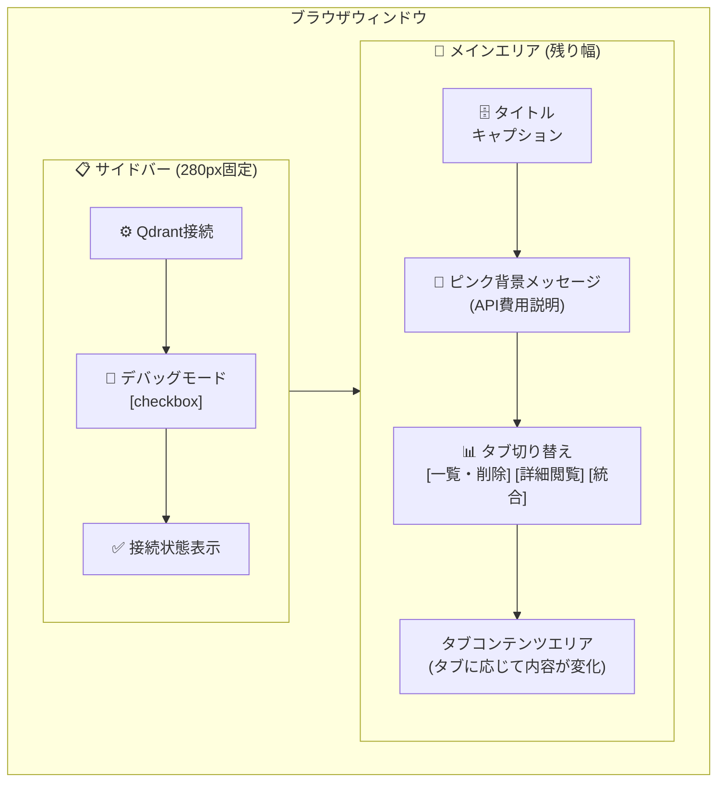

# qdrant_show_page.py - Qdrantデータ管理ページ ドキュメント

**Version 1.0** | 最終更新: 2025-01-29

---

## 目次

1. [概要](#概要)
2. [画面レイアウト図](#1-画面レイアウト図)
3. [UIコンポーネント詳細](#2-uiコンポーネント詳細)
4. [セッション状態管理](#3-セッション状態管理)
5. [ユーザー操作フロー](#4-ユーザー操作フロー)
6. [関数一覧表](#5-関数一覧表)
7. [関数 IPO詳細](#6-関数-ipo詳細)
8. [依存関係](#7-依存関係)
9. [イベント処理](#8-イベント処理)
10. [エラーハンドリング](#9-エラーハンドリング)
11. [使用例](#10-使用例)
12. [変更履歴](#11-変更履歴)

---

## 概要

`qdrant_show_page.py`は、Qdrantベクトルデータベースのコレクションを閲覧・管理するためのStreamlit UIページです。コレクションの一覧表示、削除、統合、およびポイントデータの詳細閲覧機能を提供します。

### 主な責務

- Qdrantサーバーへの接続確認とヘルスチェック
- コレクション一覧の表示と管理（削除機能）
- コレクション内のポイントデータ詳細閲覧
- 複数コレクションの統合（マージ）機能
- データソース情報の分析と表示

### 主要機能一覧

| 機能 | 説明 |
|------|------|
| `show_qdrant_page()` | メインページ表示関数 |
| `display_source_info()` | データソース情報の表示ヘルパー |
| コレクション一覧・削除 | タブ1: コレクションの表示と削除操作 |
| データ詳細閲覧 | タブ2: ポイントデータのプレビューとCSVダウンロード |
| コレクション統合 | タブ3: 複数コレクションの統合処理 |

---

## 1. 画面レイアウト図

### 1.1 全体レイアウト


### 1.2 タブ1: コレクション一覧・削除

```
┌─────────────────────────────────────────────────────────────────────────────┐
│ 📊 コレクション管理                                                           │
├─────────────────────────────────────────────────────────────────────────────┤
│                                                                             │
│  [メトリクス] 総コレクション数 / 総ポイント数: X / Y                              │
│                                                                             │
│  ─────────────────────────────────────────────────────────────────────────  │
│                                                                             │
│  | コレクション名   | ポイント数 | ステータス   | 操作        |                   │
│  |----------------|-----------|-----------|-------------|                  │
│  | `qa_wikipedia` | 1,000     | 🟢 green  | [🗑️ 削除]   |                  │
│  | `qa_livedoor`  | 500       | 🟢 green  | [🗑️ 削除]   |                  │
│  | `qa_cc_news`   | 2,000     | 🟡 yellow | [🗑️ 削除]   |                  │
│                                                                             │
│  ┌─ 削除確認ダイアログ（削除ボタン押下時に表示）─────────────────────────┐         │
│  │  ⚠️ 'qa_wikipedia' を本当に削除しますか？                                │  │
│  │  [✅ はい]  [❌ いいえ]                                                │  │
│  └───────────────────────────────────────────────────────────────────────┘  │
│                                                                             │
└─────────────────────────────────────────────────────────────────────────────┘
```

### 1.3 タブ2: データ詳細閲覧

```
┌─────────────────────────────────────────────────────────────────────────────┐
│ 🔍 ポイントデータ詳細                                                          │
├─────────────────────────────────────────────────────────────────────────────┤
│                                                                             │
│  [コレクションを選択 ▼]                                                        │
│                                                                             │
│  ┌──────────────────────────┐  ┌──────────────────────────┐                 │
│  │ [📦 データソース分析]     │  │ 表示件数: [50]           │                    │
│  └──────────────────────────┘  └──────────────────────────┘                 │
│                                                                             │
│  ─────────────────────────────────────────────────────────────────────────  │
│                                                                             │
│  [🔎 データをロード]                                                          │
│                                                                             │
│  ┌─ データフレーム表示 ─────────────────────────────────────────────────┐      │
│  │ ID | question            | answer                   | source          │  │
│  │----|----------------------|--------------------------|--------------|    │
│  │ 1  | 質問1のテキスト...    | 回答1のテキスト...       | qa_pairs.csv │        │
│  │ 2  | 質問2のテキスト...    | 回答2のテキスト...       | qa_pairs.csv │        │
│  └───────────────────────────────────────────────────────────────────────┘  │
│                                                                             │
│  [📥 CSVでダウンロード]                                                       │
│                                                                             │
└─────────────────────────────────────────────────────────────────────────────┘
```

### 1.4 タブ3: コレクション統合

```
┌─────────────────────────────────────────────────────────────────────────────┐
│ 🔗 コレクション統合                                                           │
├─────────────────────────────────────────────────────────────────────────────┤
│                                                                             │
│  統合元コレクションを選択 (2つ以上)                                              │
│  ┌───────────────────────────────────────────────────────────────────────┐  │
│  │ [✓] qa_wikipedia                                                      │  │
│  │ [✓] qa_livedoor                                                       │  │
│  │ [ ] qa_cc_news                                                        │  │
│  └───────────────────────────────────────────────────────────────────────┘  │
│                                                                             │
│  統合後のコレクション名: [integration_20250129____________]                     │
│                                                                             │
│  [✓] 既存コレクションがあれば上書きする                                           │
│                                                                             │
│  [🚀 統合を実行]                                                             │
│                                                                             │
│  ┌─ 進捗表示（実行中に表示）─────────────────────────────────────────────┐      │
│  │  ████████████████░░░░░░░░░░░░░░  50%                                  │  │
│  │  統合データをアップサート中... (500/1000)                                 │  │
│  └───────────────────────────────────────────────────────────────────────┘  │
│                                                                             │
└─────────────────────────────────────────────────────────────────────────────┘
```

### 1.5 コンポーネント配置図

```
qdrant_show_page.py
━━━━━━━━━━━━━━━━━━━━━━━━━━━━━━━━━━━━━━━━━━━━━━━━━━━━━━

[メインエリア]
  ├── st.title()                      - ページタイトル
  ├── st.caption()                    - サブタイトル
  ├── st.markdown()                   - ピンク背景メッセージ（HTML）
  │
  └── st.tabs()                       - 3つのタブ
        │
        ├── [タブ1: コレクション一覧・削除]
        │     ├── st.subheader()      - セクションタイトル
        │     ├── st.metric()         - 統計情報
        │     ├── st.columns()        - コレクション行
        │     │     ├── st.code()     - コレクション名
        │     │     ├── st.text()     - ポイント数
        │     │     ├── st.success/warning/error() - ステータス
        │     │     └── st.button()   - 削除ボタン
        │     └── st.container()      - 削除確認ダイアログ
        │
        ├── [タブ2: データ詳細閲覧]
        │     ├── st.subheader()      - セクションタイトル
        │     ├── st.selectbox()      - コレクション選択
        │     ├── st.columns()        - 操作エリア
        │     │     ├── st.button()   - データソース分析ボタン
        │     │     └── st.number_input() - 表示件数
        │     ├── st.button()         - データロードボタン
        │     ├── st.dataframe()      - ポイントデータ表示
        │     └── st.download_button() - CSVダウンロード
        │
        └── [タブ3: コレクション統合]
              ├── st.subheader()      - セクションタイトル
              ├── st.multiselect()    - 統合元選択
              ├── st.text_input()     - 統合先名入力
              ├── st.checkbox()       - 上書きオプション
              ├── st.button()         - 統合実行ボタン
              ├── st.progress()       - 進捗バー
              └── st.empty()          - ステータス/ログ表示

[サイドバー]
  ├── st.header()                     - 設定ヘッダー
  ├── st.checkbox()                   - デバッグモード
  └── st.success/error()              - 接続状態表示
```

---

## 2. UIコンポーネント詳細

### 2.1 サイドバー

| コンポーネント | 種類 | キー | デフォルト値 | 説明 |
|---------------|------|------|-------------|------|
| 設定ヘッダー | `st.header` | - | - | "⚙️ Qdrant接続" |
| デバッグモード | `st.checkbox` | - | `qdrant_debug_mode`の値 | 詳細エラー情報の表示切り替え |
| 接続状態 | `st.success`/`st.error` | - | - | Qdrantサーバーへの接続状態表示 |

#### デバッグモードの詳細

```python
debug_mode = st.checkbox(
    "🐛 デバッグモード", value=st.session_state.qdrant_debug_mode
)
st.session_state.qdrant_debug_mode = debug_mode
```

**機能**:
- 有効時: エラー発生時にスタックトレースを含む詳細情報を表示
- 無効時: ユーザー向けの簡潔なエラーメッセージのみ表示

### 2.2 メインエリア

| コンポーネント | 種類 | 説明 |
|---------------|------|------|
| タイトル | `st.title` | "🗄️ Qdrantデータ管理" |
| キャプション | `st.caption` | ページ説明文 |
| ピンクメッセージ | `st.markdown` | API費用に関する注意メッセージ（HTML） |
| タブ | `st.tabs` | 3つのタブ切り替えUI |

### 2.3 タブ1: コレクション一覧・削除

| コンポーネント | 種類 | キー | 説明 |
|---------------|------|------|------|
| メトリクス | `st.metric` | - | 総コレクション数/総ポイント数 |
| コレクション名 | `st.code` | - | コレクション名の表示 |
| ポイント数 | `st.text` | - | ポイント数の表示 |
| ステータス | `st.success/warning/error` | - | コレクション状態の色分け表示 |
| 削除ボタン | `st.button` | `del_btn_{name}` | 各コレクションの削除ボタン |
| 確認ボタン（はい） | `st.button` | `yes_del_{name}` | 削除確認 |
| 確認ボタン（いいえ） | `st.button` | `no_del_{name}` | 削除キャンセル |

### 2.4 タブ2: データ詳細閲覧

| コンポーネント | 種類 | キー | デフォルト値 | 説明 |
|---------------|------|------|-------------|------|
| コレクション選択 | `st.selectbox` | `details_collection_select` | 最初のコレクション | 詳細表示対象の選択 |
| データソース分析ボタン | `st.button` | - | - | ソース情報の分析実行 |
| 表示件数 | `st.number_input` | - | 50 | ロードするポイント数（10〜500） |
| データロードボタン | `st.button` | - | - | ポイントデータのロード実行 |
| データフレーム | `st.dataframe` | - | - | ポイントデータの表示 |
| CSVダウンロード | `st.download_button` | - | - | データのCSVエクスポート |

### 2.5 タブ3: コレクション統合

| コンポーネント | 種類 | キー | デフォルト値 | 説明 |
|---------------|------|------|-------------|------|
| 統合元選択 | `st.multiselect` | - | `[]` | 統合するコレクションの選択 |
| 統合先名 | `st.text_input` | - | `integration_{日付}` | 統合後のコレクション名 |
| 上書きオプション | `st.checkbox` | `merge_recreate` | `True` | 既存コレクションの上書き |
| 統合実行ボタン | `st.button` | - | - | 統合処理の開始 |
| 進捗バー | `st.progress` | - | - | 統合進捗の表示 |
| ステータステキスト | `st.empty` | - | - | 現在の処理状態表示 |
| ログエリア | `st.empty` | - | - | 処理ログの表示 |

---

## 3. セッション状態管理

### 3.1 状態一覧

| キー | 型 | 初期値 | 説明 | ライフサイクル |
|------|-----|--------|------|---------------|
| `qdrant_debug_mode` | `bool` | `False` | デバッグモードの有効/無効 | セッション継続中 |
| `confirm_delete_{name}` | `bool` | `False` | 各コレクションの削除確認状態 | 削除操作完了まで |

### 3.2 状態遷移図

```
[初期状態]
    │
    ▼
┌─────────────────────────────────────────────────────┐
│  qdrant_debug_mode = False                          │
│  confirm_delete_* = (未設定)                         │
└─────────────────────────────────────────────────────┘
    │
    │ デバッグモード変更
    ▼
┌─────────────────────────────────────────────────────┐
│  qdrant_debug_mode = True/False                     │
│  → HealthCheckerに反映                               │
└─────────────────────────────────────────────────────┘
    │
    │ 削除ボタンクリック
    ▼
┌─────────────────────────────────────────────────────┐
│  confirm_delete_{collection_name} = True            │
│  → 削除確認ダイアログ表示                               │
└─────────────────────────────────────────────────────┘
    │
    ├─── [はい] クリック ──► 削除実行 → confirm_delete_* = False → st.rerun()
    │
    └─── [いいえ] クリック ──► confirm_delete_* = False → st.rerun()
```

### 3.3 初期化・リセット条件

| 条件 | 対象状態 | 処理 |
|------|---------|------|
| ページ初回アクセス | `qdrant_debug_mode` | `False`で初期化 |
| 削除確認「はい」 | `confirm_delete_{name}` | `False`に設定後 `st.rerun()` |
| 削除確認「いいえ」 | `confirm_delete_{name}` | `False`に設定後 `st.rerun()` |
| 統合完了 | - | `st.rerun()` でページ再読み込み |

---

## 4. ユーザー操作フロー

### 4.1 基本操作フロー

```
[ページアクセス]
      │
      ▼
[Qdrant接続確認] ─── 失敗 ──► [エラー表示・Docker起動案内] ──► 終了
      │
      │ 成功
      ▼
[タブ選択]
      │
      ├─── [タブ1: 一覧・削除]
      │         │
      │         ├── コレクション一覧表示
      │         │
      │         └── 削除ボタン ──► 確認ダイアログ ──► 削除実行
      │
      ├─── [タブ2: 詳細閲覧]
      │         │
      │         ├── コレクション選択
      │         │
      │         ├── データソース分析ボタン ──► ソース情報表示
      │         │
      │         └── データロードボタン ──► データフレーム表示 ──► CSVダウンロード
      │
      └─── [タブ3: 統合]
                │
                ├── 統合元コレクション選択（2つ以上）
                │
                ├── 統合先名入力
                │
                └── 統合実行ボタン ──► 進捗表示 ──► 完了通知
```

### 4.2 操作シーケンス図

#### コレクション削除シーケンス

```
┌──────────┐          ┌──────────────┐          ┌──────────┐
│  User    │          │  Streamlit   │          │  Qdrant  │
└────┬─────┘          └──────┬───────┘          └────┬─────┘
     │                       │                       │
     │  1. 削除ボタンクリック   │                       │
     │ ─────────────────────►│                       │
     │                       │                       │
     │  2. 確認ダイアログ表示   │                       │
     │ ◄─────────────────────│                       │
     │                       │                       │
     │  3. 「はい」クリック     │                       │
     │ ─────────────────────►│                       │
     │                       │                       │
     │                       │  4. delete_collection │
     │                       │ ─────────────────────►│
     │                       │                       │
     │                       │  5. 削除完了           │
     │                       │ ◄─────────────────────│
     │                       │                       │
     │  6. 成功メッセージ      │                       │
     │ ◄─────────────────────│                       │
     │                       │                       │
     │  7. ページ再読み込み     │                       │
     │ ◄─────────────────────│                       │
     │                       │                       │
```

#### コレクション統合シーケンス

```
┌──────────┐          ┌──────────────┐          ┌──────────┐
│  User    │          │  Streamlit   │          │  Qdrant  │
└────┬─────┘          └──────┬───────┘          └────┬─────┘
     │                       │                       │
     │  1. コレクション選択     │                       │
     │ ─────────────────────►│                       │
     │                       │                       │
     │  2. 統合実行クリック     │                       │
     │ ─────────────────────►│                       │
     │                       │                       │
     │                       │  3. コレクション作成     │
     │  進捗: 0%              │ ─────────────────────►│
     │ ◄─────────────────────│                       │
     │                       │                       │
     │                       │  4. ポイント取得(各)    │
     │  進捗: 10-50%          │ ◄────────────────────►│
     │ ◄─────────────────────│                       │
     │                       │                       │
     │                       │  5. アップサート       │
     │  進捗: 50-100%        │ ─────────────────────►│
     │ ◄─────────────────────│                       │
     │                       │                       │
     │  6. 完了通知 🎊        │                       │
     │ ◄─────────────────────│                       │
     │                       │                       │
```

---

## 5. 関数一覧表

### 5.1 メイン関数

| 関数名 | 概要 |
|-------|------|
| `show_qdrant_page()` | ページ全体のレンダリングと制御 |

### 5.2 ヘルパー関数（ページ内定義）

| 関数名 | 概要 |
|-------|------|
| `display_source_info(source_info: dict)` | データソース情報の表示 |

### 5.3 インポート関数

| 関数名 | モジュール | 概要 |
|-------|-----------|------|
| `QdrantHealthChecker` | `services.qdrant_service` | Qdrant接続ヘルスチェック |
| `QdrantDataFetcher` | `services.qdrant_service` | Qdrantデータ取得 |
| `QDRANT_CONFIG` | `services.qdrant_service` | Qdrant接続設定 |
| `merge_collections()` | `services.qdrant_service` | コレクション統合 |
| `get_collection_stats()` | `services.qdrant_service` | コレクション統計取得 |
| `get_all_collections()` | `services.qdrant_service` | 全コレクション情報取得 |

---

## 6. 関数 IPO詳細

### 6.1 `show_qdrant_page`

**概要**: Qdrantデータ管理ページのメイン表示関数。サイドバー設定、3つのタブ（一覧・削除、詳細閲覧、統合）を統合管理する。

```python
def show_qdrant_page() -> None
```

| 項目 | 内容 |
|------|------|
| **Input** | なし（セッション状態から取得） |
| **Process** | 1. セッション状態の初期化<br>2. サイドバー（接続設定）の描画<br>3. Qdrant接続確認<br>4. タブUIの描画<br>5. 各タブの処理（削除/詳細/統合） |
| **Output** | なし（画面描画のみ） |

**主要処理フロー**:

```python
# 1. セッション状態初期化
if "qdrant_debug_mode" not in st.session_state:
    st.session_state.qdrant_debug_mode = False

# 2. サイドバー設定
with st.sidebar:
    debug_mode = st.checkbox("🐛 デバッグモード", ...)
    checker = QdrantHealthChecker(debug_mode=debug_mode)
    is_connected, message, _ = checker.check_qdrant()

# 3. 接続確認
if not is_connected:
    st.error(...)
    return

# 4. タブUI
tab_list, tab_details, tab_merge = st.tabs([...])

# 5. 各タブの処理
with tab_list:
    # コレクション一覧・削除処理
with tab_details:
    # データ詳細閲覧処理
with tab_merge:
    # コレクション統合処理
```

### 6.2 `display_source_info`

**概要**: データソース情報をメトリクスとテーブル形式で表示するヘルパー関数。

```python
def display_source_info(source_info: dict) -> None
```

| 項目 | 内容 |
|------|------|
| **Input** | `source_info`: ソース情報辞書（`QdrantDataFetcher.fetch_collection_source_info()`の戻り値） |
| **Process** | 1. エラーチェック<br>2. メトリクス表示（総ポイント数、ソース数、サンプルサイズ）<br>3. ソース情報テーブル表示 |
| **Output** | なし（画面描画のみ） |

**入力データ構造**:

```python
source_info = {
    "total_points": int,           # 総ポイント数
    "sources": {                   # ソース別統計
        "source_name": {
            "sample_count": int,
            "estimated_total": int,
            "percentage": float,
            "method": str,
            "domain": str
        }
    },
    "sample_size": int,            # サンプルサイズ
    "error": str                   # エラー時のみ
}
```

### 6.3 `QdrantHealthChecker` クラス

**概要**: Qdrantサーバーの接続状態をチェックするクラス。

**参照**: `services/qdrant_service.py`

```python
class QdrantHealthChecker:
    def __init__(self, debug_mode: bool = False)
    def check_port(self, host: str, port: int, timeout: float = 2.0) -> bool
    def check_qdrant(self) -> Tuple[bool, str, Optional[Dict]]
```

| メソッド | Input | Process | Output |
|---------|-------|---------|--------|
| `__init__` | `debug_mode: bool` | インスタンス初期化 | なし |
| `check_port` | `host`, `port`, `timeout` | ソケット接続テスト | `bool`: ポート開放状態 |
| `check_qdrant` | なし | Qdrant API接続テスト | `Tuple[bool, str, Optional[Dict]]`: (接続成功, メッセージ, メトリクス) |

**`check_qdrant`の戻り値**:

```python
# 成功時
(True, "Connected", {
    "collection_count": int,
    "collections": List[str],
    "response_time_ms": float
})

# 失敗時
(False, "エラーメッセージ", None)
```

### 6.4 `QdrantDataFetcher` クラス

**概要**: Qdrantからデータを取得するクラス。

**参照**: `services/qdrant_service.py`

```python
class QdrantDataFetcher:
    def __init__(self, client: QdrantClient)
    def fetch_collections(self) -> pd.DataFrame
    def fetch_collection_points(self, collection_name: str, limit: int = 50) -> pd.DataFrame
    def fetch_collection_info(self, collection_name: str) -> Dict[str, Any]
    def fetch_collection_source_info(self, collection_name: str, sample_size: int = 200) -> Dict[str, Any]
```

| メソッド | Input | Output |
|---------|-------|--------|
| `fetch_collections` | なし | `DataFrame`: コレクション一覧 |
| `fetch_collection_points` | `collection_name`, `limit` | `DataFrame`: ポイントデータ |
| `fetch_collection_info` | `collection_name` | `Dict`: コレクション詳細情報 |
| `fetch_collection_source_info` | `collection_name`, `sample_size` | `Dict`: ソース情報 |

### 6.5 `get_all_collections`

**概要**: 全コレクションの基本情報を取得する。

**参照**: `services/qdrant_service.py`

```python
def get_all_collections(client: QdrantClient) -> List[Dict[str, Any]]
```

| 項目 | 内容 |
|------|------|
| **Input** | `client`: QdrantClientインスタンス |
| **Process** | 全コレクションの名前、ポイント数、ステータスを取得 |
| **Output** | `List[Dict]`: コレクション情報のリスト |

**戻り値の構造**:

```python
[
    {
        "name": str,          # コレクション名
        "points_count": int,  # ポイント数
        "status": str         # ステータス ("green", "yellow", "Error")
    },
    ...
]
```

### 6.6 `merge_collections`

**概要**: 複数のコレクションを統合して新しいコレクションを作成する。

**参照**: `services/qdrant_service.py`

```python
def merge_collections(
    client: QdrantClient,
    source_collections: List[str],
    target_collection: str,
    recreate: bool = True,
    vector_size: int = 3072,
    progress_callback: Optional[callable] = None
) -> Dict[str, Any]
```

| 項目 | 内容 |
|------|------|
| **Input** | `client`: QdrantClient<br>`source_collections`: 統合元コレクション名リスト<br>`target_collection`: 統合先コレクション名<br>`recreate`: 既存削除フラグ<br>`vector_size`: ベクトル次元数<br>`progress_callback`: 進捗コールバック |
| **Process** | 1. 統合先コレクション作成<br>2. 各ソースからポイント取得<br>3. ID再生成してアップサート |
| **Output** | `Dict`: 統合結果 |

**戻り値の構造**:

```python
{
    "source_collections": List[str],     # 統合元コレクション
    "target_collection": str,            # 統合先コレクション
    "points_per_collection": Dict[str, int],  # 各コレクションのポイント数
    "total_points": int,                 # 総ポイント数
    "success": bool,                     # 成功フラグ
    "error": Optional[str]               # エラーメッセージ
}
```

**進捗コールバックのシグネチャ**:

```python
def progress_callback(message: str, current: int, total: int) -> None
```

### 6.7 `get_collection_stats`

**概要**: コレクションの統計情報を取得する。

**参照**: `services/qdrant_service.py`

```python
def get_collection_stats(client: QdrantClient, collection_name: str) -> Optional[Dict[str, Any]]
```

| 項目 | 内容 |
|------|------|
| **Input** | `client`: QdrantClient<br>`collection_name`: コレクション名 |
| **Process** | コレクションのポイント数、ベクトル設定、ステータスを取得 |
| **Output** | `Optional[Dict]`: 統計情報（コレクションが存在しない場合は`None`） |

**戻り値の構造**:

```python
{
    "total_points": int,
    "vector_config": {
        "default": {
            "size": int,
            "distance": str
        }
    },
    "status": str
}
```

---

## 7. 依存関係

### 7.1 外部ライブラリ

| ライブラリ | 推奨バージョン | 用途 |
|-----------|---------------|------|
| `streamlit` | >= 1.28 | UIフレームワーク |
| `pandas` | >= 2.0 | データフレーム表示 |
| `qdrant-client` | >= 1.6 | Qdrant接続 |

### 7.2 内部モジュール

| モジュール | 用途 |
|-----------|------|
| `logging` | ログ出力 |
| `time` | 遅延処理 |
| `datetime` | 日付生成（統合コレクション名） |

### 7.3 サービス層

| サービス | 用途 |
|---------|------|
| `services.qdrant_service.QdrantHealthChecker` | Qdrant接続確認 |
| `services.qdrant_service.QdrantDataFetcher` | データ取得 |
| `services.qdrant_service.QDRANT_CONFIG` | 接続設定 |
| `services.qdrant_service.merge_collections` | コレクション統合 |
| `services.qdrant_service.get_collection_stats` | 統計情報取得 |
| `services.qdrant_service.get_all_collections` | コレクション一覧取得 |

### 7.4 設定値（QDRANT_CONFIG）

```python
QDRANT_CONFIG = {
    "name": "Qdrant",
    "host": "localhost",
    "port": 6333,
    "icon": "🎯",
    "url": "http://localhost:6333",
    "health_check_endpoint": "/collections",
    "docker_image": "qdrant/qdrant"
}
```

---

## 8. イベント処理

### 8.1 ボタンイベント

| ボタン | イベント | 処理内容 |
|-------|---------|---------|
| 🗑️ 削除 | クリック | `confirm_delete_{name} = True` で確認ダイアログ表示 |
| ✅ はい（削除確認） | クリック | `client.delete_collection(name)` 実行、`st.rerun()` |
| ❌ いいえ（削除確認） | クリック | `confirm_delete_{name} = False`、`st.rerun()` |
| 📦 データソース分析 | クリック | `fetch_collection_source_info()` 実行、結果表示 |
| 🔎 データをロード | クリック | `fetch_collection_points()` 実行、DataFrame表示 |
| 📥 CSVダウンロード | クリック | DataFrameをCSV形式でダウンロード |
| 🚀 統合を実行 | クリック | `merge_collections()` 実行、進捗表示 |

### 8.2 入力イベント

| コンポーネント | イベント | 処理内容 |
|---------------|---------|---------|
| デバッグモード | 変更 | `st.session_state.qdrant_debug_mode` 更新 |
| コレクション選択（詳細） | 変更 | 選択コレクションの更新 |
| 表示件数 | 変更 | ロード時の取得件数に反映 |
| 統合元選択 | 変更 | 統合対象コレクションリストの更新 |
| 統合先名 | 変更 | 統合先コレクション名の更新 |
| 上書きオプション | 変更 | `recreate`フラグの更新 |

### 8.3 リアルタイム更新

| イベント種別 | 更新内容 |
|-------------|---------|
| 統合進捗 | `st.progress()`でプログレスバー更新 |
| 統合ステータス | `st.empty()`でステータステキスト更新 |
| 統合ログ | `st.empty()`でログ表示更新（最新5行） |

---

## 9. エラーハンドリング

### 9.1 エラー種別

| エラー種別 | 発生条件 | 対処 |
|-----------|---------|------|
| Qdrant接続エラー | サーバー未起動、ネットワークエラー | `st.error`で表示、Docker起動コマンドを案内、処理中断 |
| コレクション削除エラー | 権限エラー、コレクション不在 | `st.error`で表示、処理継続 |
| データ取得エラー | コレクション不在、タイムアウト | `st.warning`で表示、空DataFrameを返す |
| 統合エラー | ディスク容量不足、メモリ不足 | エラーメッセージを結果に格納、`st.error`で表示 |
| コレクション情報取得エラー | 内部エラー | ログ出力、デフォルト値（0, "Error"）で続行 |

### 9.2 エラー表示

| 表示種別 | Streamlitコンポーネント | 用途 |
|---------|------------------------|------|
| エラー | `st.error()` | 致命的エラー（接続失敗等） |
| 警告 | `st.warning()` | 注意喚起（データなし、統合要件不足等） |
| 情報 | `st.info()` | 補足情報（コレクションなし等） |
| 成功 | `st.success()` | 処理完了通知 |

### 9.3 エラー処理コード例

```python
# 接続エラー処理
try:
    client = QdrantClient(url=QDRANT_CONFIG["url"], timeout=10)
    data_fetcher = QdrantDataFetcher(client)
except Exception as e:
    st.error(f"クライアント初期化エラー: {e}")
    return

# 削除エラー処理
try:
    client.delete_collection(name)
    st.success(f"削除しました: {name}")
except Exception as e:
    st.error(f"削除エラー: {e}")

# 統合エラー処理
try:
    result = merge_collections(...)
    if result["success"]:
        st.success(f"✅ 統合完了！ 合計 {result['total_points']:,} ポイント")
    else:
        st.error(f"失敗: {result['error']}")
except Exception as e:
    st.error(f"予期せぬエラー: {e}")
```

---

## 10. 使用例

### 10.1 基本的な使用方法

1. ページにアクセス
2. サイドバーでQdrant接続状態を確認
   - 接続成功: 緑色で「✅ 接続済み」と表示
   - 接続失敗: Docker起動コマンドが表示される
3. タブを選択して各機能を使用

### 10.2 コレクション削除の手順

1. 「📊 コレクション一覧・削除」タブを選択
2. 削除したいコレクションの「🗑️ 削除」ボタンをクリック
3. 確認ダイアログで「✅ はい」をクリック
4. 削除完了メッセージを確認

### 10.3 データ詳細閲覧の手順

1. 「🔍 データ詳細閲覧」タブを選択
2. コレクションをドロップダウンから選択
3. 必要に応じて表示件数を変更（デフォルト: 50件）
4. 「🔎 データをロード」ボタンをクリック
5. データフレームで内容を確認
6. 必要に応じて「📥 CSVでダウンロード」でエクスポート

### 10.4 コレクション統合の手順

1. 「🔗 コレクション統合」タブを選択
2. 統合元コレクションを2つ以上選択
3. 統合後のコレクション名を入力（または自動生成名を使用）
4. 「既存コレクションがあれば上書きする」オプションを確認
5. 「🚀 統合を実行」ボタンをクリック
6. 進捗バーで処理状況を確認
7. 完了通知（🎊）を確認

### 10.5 トラブルシューティング

| 症状 | 原因 | 対処 |
|------|------|------|
| 「❌ 未接続」と表示される | Qdrantサーバーが起動していない | `docker run -p 6333:6333 qdrant/qdrant` を実行 |
| コレクションが表示されない | データ未登録 | 「CSVデータ登録」ページでデータを登録 |
| 統合ボタンが押せない | 選択コレクションが2つ未満 | 2つ以上のコレクションを選択 |
| データロードが遅い | ポイント数が多い | 表示件数を減らす |

---

## 11. 変更履歴

| バージョン | 日付 | 変更内容 |
|-----------|------|---------|
| 1.0 | 2025-01-29 | 初版作成 |

---

## 付録: 関連ドキュメント

| ドキュメント | 説明 |
|-------------|------|
| `qdrant_service.py` | サービス層の詳細実装 |
| `qdrant_registration_page.md` | CSVデータ登録ページのドキュメント |
| `qdrant_search_page.md` | Qdrant検索ページのドキュメント |

