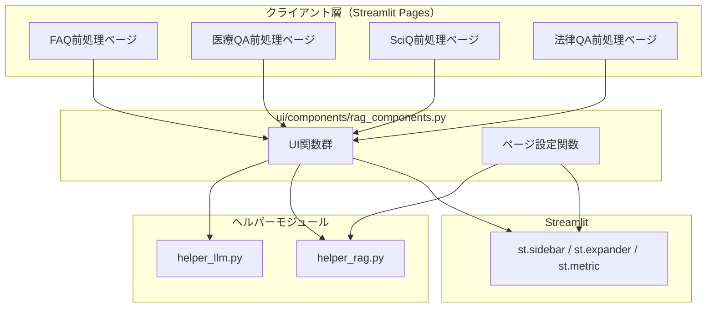
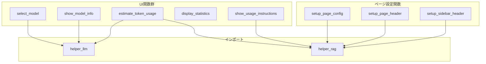
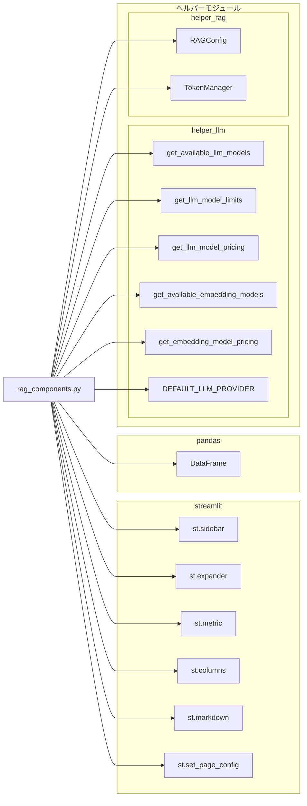
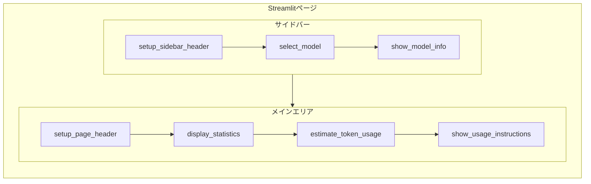

# rag_components.py - RAGデータ前処理用UIコンポーネント ドキュメント

**Version 1.0** | 最終更新: 2025-01-29

---

## 目次

1. [概要](#概要)
2. [アーキテクチャ構成図](#1-アーキテクチャ構成図)
3. [モジュール構成図](#2-モジュール構成図)
4. [クラス・関数一覧表](#3-クラス関数一覧表)
5. [クラス・関数 IPO詳細](#4-クラス関数-ipo詳細)
6. [設定・定数](#5-設定定数)
7. [使用例](#6-使用例)
8. [エクスポート](#7-エクスポート)
9. [変更履歴](#8-変更履歴)
10. [付録: 依存関係図](#付録-依存関係図)

---

## 概要

`ui/components/rag_components.py`は、RAG（Retrieval-Augmented Generation）データ前処理アプリケーション用のStreamlit UIコンポーネントを提供するモジュールです。モデル選択、トークン使用量推定、統計情報表示、使用方法説明などのUI機能を集約しています。

### 主な責務

- LLMモデル選択UIの提供
- 選択モデルの情報表示（料金、制限、推奨度）
- 処理済みデータのトークン使用量・コスト推定
- 処理前後の統計情報表示
- データセット別使用方法説明の表示
- ページ設定・ヘッダーの初期化

### 主要機能一覧

| 機能 | 説明 |
|------|------|
| `select_model()` | サイドバーでのLLMモデル選択UI |
| `show_model_info()` | 選択モデルの詳細情報表示 |
| `estimate_token_usage()` | トークン使用量とコストの推定表示 |
| `display_statistics()` | 処理前後のデータ統計情報表示 |
| `show_usage_instructions()` | データセット別の使用方法説明表示 |
| `setup_page_config()` | Streamlitページ設定の初期化 |
| `setup_page_header()` | ページヘッダーの設定 |
| `setup_sidebar_header()` | サイドバーヘッダーの設定 |

---

## 1. アーキテクチャ構成図

### 1.1 システム全体構成



### 1.2 データフロー

1. 前処理ページがUI関数を呼び出し
2. `helper_llm`からモデル情報・料金を取得
3. `helper_rag`から設定情報を取得
4. Streamlitコンポーネントで画面表示
5. ユーザー操作結果を呼び出し元に返却

---

## 2. モジュール構成図

### 2.1 内部モジュール構成



### 2.2 外部依存関係

| ライブラリ | バージョン | 用途 |
|-----------|-----------|------|
| `streamlit` | >= 1.28 | UIフレームワーク |
| `pandas` | >= 2.0 | データフレーム操作 |

### 2.3 内部依存モジュール

| モジュール | 用途 |
|-----------|------|
| `helper.helper_llm` | LLMモデル情報取得（料金、制限、一覧） |
| `helper.helper_rag` | RAG設定（RAGConfig）、トークン管理（TokenManager） |

---

## 3. クラス・関数一覧表

### 3.1 UI関数一覧

| 関数名 | 概要 |
|-------|------|
| `select_model(key)` | サイドバーでLLMモデルを選択するUI |
| `show_model_info(selected_model)` | 選択モデルの詳細情報を表示 |
| `estimate_token_usage(df_processed, selected_model)` | トークン使用量とコストを推定 |
| `display_statistics(df_original, df_processed, dataset_type)` | 処理前後の統計情報を表示 |
| `show_usage_instructions(dataset_type)` | データセット別の使用方法を表示 |

### 3.2 ページ設定関数一覧

| 関数名 | 概要 |
|-------|------|
| `setup_page_config(dataset_type)` | Streamlitページ設定を初期化 |
| `setup_page_header(dataset_type)` | メインエリアのヘッダーを設定 |
| `setup_sidebar_header(dataset_type)` | サイドバーのヘッダーを設定 |

---

## 4. クラス・関数 IPO詳細

### 4.1 UI関数

#### `select_model`

**概要**: サイドバーにLLMモデル選択のセレクトボックスを表示し、選択されたモデル名を返す。

```python
def select_model(key: str = "model_selection") -> str
```

| パラメータ | 型 | デフォルト | 説明 |
|------------|------|-----------|------|
| `key` | `str` | `"model_selection"` | Streamlitウィジェットの一意キー |

| 項目 | 内容 |
|------|------|
| **Input** | `key: str = "model_selection"` |
| **Process** | 1. `get_available_llm_models()`でモデル一覧取得<br>2. デフォルトモデルのインデックス特定<br>3. `st.sidebar.selectbox()`でUI表示 |
| **Output** | `str`: 選択されたモデル名 |

**戻り値例**:

```python
"gemini-2.0-flash"
```

```python
# 使用例
from ui.components.rag_components import select_model

selected = select_model(key="my_model_select")
print(f"選択モデル: {selected}")
# 出力: 選択モデル: gemini-2.0-flash
```

---

#### `show_model_info`

**概要**: 選択されたモデルの詳細情報（制限、料金、特性、RAG推奨度）をサイドバーのエキスパンダーに表示する。

```python
def show_model_info(selected_model: str) -> None
```

| パラメータ | 型 | デフォルト | 説明 |
|------------|------|-----------|------|
| `selected_model` | `str` | - | 選択されたモデル名 |

| 項目 | 内容 |
|------|------|
| **Input** | `selected_model: str` |
| **Process** | 1. `get_llm_model_limits()`で制限情報取得<br>2. `get_llm_model_pricing()`で料金情報取得<br>3. モデル特性を判定（Gemini 2.0/1.5/GPT等）<br>4. RAG用途推奨度を判定（flash/pro/gpt）<br>5. `st.sidebar.expander()`で情報表示 |
| **Output** | なし（画面表示のみ） |

**表示内容**:

| 項目 | 説明 |
|------|------|
| 最大入力 | 最大入力トークン数 |
| 最大出力 | 最大出力トークン数 |
| 料金（1000トークン） | 入力/出力の料金 |
| モデル特性 | Gemini 2.0/1.5/OpenAI互換等 |
| RAG用途推奨度 | 最適/高品質/標準 |

```python
# 使用例
from ui.components.rag_components import select_model, show_model_info

selected = select_model()
show_model_info(selected)
# サイドバーにモデル情報が表示される
```

---

#### `estimate_token_usage`

**概要**: 処理済みDataFrameのトークン使用量とEmbeddingコストを推定し、エキスパンダーに表示する。

```python
def estimate_token_usage(df_processed: pd.DataFrame, selected_model: str) -> None
```

| パラメータ | 型 | デフォルト | 説明 |
|------------|------|-----------|------|
| `df_processed` | `pd.DataFrame` | - | 処理済みデータフレーム（`Combined_Text`列を含む） |
| `selected_model` | `str` | - | 選択されたLLMモデル名 |

| 項目 | 内容 |
|------|------|
| **Input** | `df_processed: pd.DataFrame`, `selected_model: str` |
| **Process** | 1. `Combined_Text`列の存在確認<br>2. サンプルテキスト（最大10件）でトークン数計測<br>3. 全体のトークン数を比例推定<br>4. Embeddingモデルの料金取得<br>5. コスト計算<br>6. `st.expander()`でメトリクス表示 |
| **Output** | なし（画面表示のみ） |

**表示内容**:

| メトリクス | 説明 |
|-----------|------|
| 推定総トークン数 | 全レコードの推定トークン数 |
| 平均トークン/レコード | 1レコードあたりの平均トークン数 |
| 推定embedding費用 | Embeddingにかかる推定コスト（USD） |

```python
# 使用例
import pandas as pd
from ui.components.rag_components import estimate_token_usage

df = pd.DataFrame({
    "Combined_Text": ["質問1の内容 回答1の内容", "質問2の内容 回答2の内容"]
})
estimate_token_usage(df, "gemini-2.0-flash")
# エキスパンダーにトークン使用量が表示される
```

---

#### `display_statistics`

**概要**: 処理前後のデータ統計情報（行数、文字数分布）を表示する。

```python
def display_statistics(
    df_original: pd.DataFrame,
    df_processed: pd.DataFrame,
    dataset_type: str = None
) -> None
```

| パラメータ | 型 | デフォルト | 説明 |
|------------|------|-----------|------|
| `df_original` | `pd.DataFrame` | - | 元のデータフレーム |
| `df_processed` | `pd.DataFrame` | - | 処理済みデータフレーム |
| `dataset_type` | `str` | `None` | データセットタイプ（現在未使用） |

| 項目 | 内容 |
|------|------|
| **Input** | `df_original`, `df_processed`, `dataset_type` |
| **Process** | 1. 行数統計（元/処理後/除去数）を計算<br>2. `Combined_Text`列の文字数統計を計算<br>3. パーセンタイル（25%/50%/75%）を計算<br>4. `st.metric()`と`st.columns()`で表示 |
| **Output** | なし（画面表示のみ） |

**表示内容**:

| セクション | 項目 |
|-----------|------|
| 基本統計 | 元の行数、処理後の行数、除去された行数 |
| テキスト分析 | 平均文字数、最大文字数、最小文字数 |
| 文字数分布 | 25%点、中央値、75%点 |

```python
# 使用例
import pandas as pd
from ui.components.rag_components import display_statistics

df_original = pd.DataFrame({"question": ["Q1", "Q2", "Q3"]})
df_processed = pd.DataFrame({
    "question": ["Q1", "Q2"],
    "Combined_Text": ["質問1 回答1", "質問2 回答2"]
})
display_statistics(df_original, df_processed)
# 統計情報が表示される
```

---

#### `show_usage_instructions`

**概要**: データセットタイプに応じた使用方法説明をMarkdown形式で表示する。

```python
def show_usage_instructions(dataset_type: str) -> None
```

| パラメータ | 型 | デフォルト | 説明 |
|------------|------|-----------|------|
| `dataset_type` | `str` | - | データセットタイプ |

| 項目 | 内容 |
|------|------|
| **Input** | `dataset_type: str` |
| **Process** | 1. `RAGConfig.get_config()`で設定取得<br>2. 基本的な使用方法テキスト生成<br>3. データセット固有の説明テキスト生成<br>4. `st.markdown()`で表示 |
| **Output** | なし（画面表示のみ） |

**対応データセット**:

| dataset_type | 説明 |
|--------------|------|
| `customer_support_faq` | カスタマーサポートFAQ |
| `medical_qa` | 医療QAデータ |
| `sciq_qa` | 科学・技術QA（SciQ） |
| `legal_qa` | 法律・判例QA |

```python
# 使用例
from ui.components.rag_components import show_usage_instructions

show_usage_instructions("medical_qa")
# 医療QAデータ用の使用方法が表示される
```

---

### 4.2 ページ設定関数

#### `setup_page_config`

**概要**: Streamlitのページ設定（タイトル、アイコン、レイアウト）を初期化する。

```python
def setup_page_config(dataset_type: str) -> None
```

| パラメータ | 型 | デフォルト | 説明 |
|------------|------|-----------|------|
| `dataset_type` | `str` | - | データセットタイプ |

| 項目 | 内容 |
|------|------|
| **Input** | `dataset_type: str` |
| **Process** | 1. `RAGConfig.get_config()`で設定取得<br>2. `st.set_page_config()`でページ設定<br>3. 既に設定済みの場合は例外をキャッチして無視 |
| **Output** | なし（ページ設定のみ） |

**設定内容**:

| 項目 | 値 |
|------|-----|
| `page_title` | `{name}前処理（完全独立版）` |
| `page_icon` | データセットのアイコン |
| `layout` | `"wide"` |
| `initial_sidebar_state` | `"expanded"` |

```python
# 使用例
from ui.components.rag_components import setup_page_config

setup_page_config("customer_support_faq")
# ページ設定が適用される
```

---

#### `setup_page_header`

**概要**: メインエリアにページタイトルとキャプションを表示する。

```python
def setup_page_header(dataset_type: str) -> None
```

| パラメータ | 型 | デフォルト | 説明 |
|------------|------|-----------|------|
| `dataset_type` | `str` | - | データセットタイプ |

| 項目 | 内容 |
|------|------|
| **Input** | `dataset_type: str` |
| **Process** | 1. `RAGConfig.get_config()`で設定取得<br>2. `st.title()`でタイトル表示<br>3. `st.caption()`でサブタイトル表示<br>4. `st.markdown("---")`で区切り線表示 |
| **Output** | なし（画面表示のみ） |

```python
# 使用例
from ui.components.rag_components import setup_page_header

setup_page_header("medical_qa")
# "🏥 医療QAデータ前処理アプリ" がタイトルとして表示される
```

---

#### `setup_sidebar_header`

**概要**: サイドバーにタイトルと区切り線を表示する。

```python
def setup_sidebar_header(dataset_type: str) -> None
```

| パラメータ | 型 | デフォルト | 説明 |
|------------|------|-----------|------|
| `dataset_type` | `str` | - | データセットタイプ |

| 項目 | 内容 |
|------|------|
| **Input** | `dataset_type: str` |
| **Process** | 1. `RAGConfig.get_config()`で設定取得<br>2. `st.sidebar.title()`でタイトル表示<br>3. `st.sidebar.markdown("---")`で区切り線表示 |
| **Output** | なし（画面表示のみ） |

```python
# 使用例
from ui.components.rag_components import setup_sidebar_header

setup_sidebar_header("sciq_qa")
# サイドバーに "🔬 科学・技術QA（SciQ）" が表示される
```

---

## 5. 設定・定数

本モジュールには独自の設定・定数はありません。

以下のモジュールから設定を取得しています：

### 5.1 helper_llm からのインポート

| 定数/関数 | 用途 |
|----------|------|
| `DEFAULT_LLM_PROVIDER` | デフォルトのLLMプロバイダー |
| `get_available_llm_models()` | 利用可能なLLMモデル一覧 |
| `get_llm_model_limits()` | モデルの制限情報 |
| `get_llm_model_pricing()` | モデルの料金情報 |
| `get_available_embedding_models()` | 利用可能なEmbeddingモデル一覧 |
| `get_embedding_model_pricing()` | Embeddingモデルの料金 |

### 5.2 helper_rag からのインポート

| クラス/関数 | 用途 |
|------------|------|
| `RAGConfig` | データセット設定の取得 |
| `TokenManager` | トークン数のカウント |

---

## 6. 使用例

### 6.1 基本的なワークフロー

```python
import streamlit as st
import pandas as pd
from ui.components.rag_components import (
    setup_page_config,
    setup_page_header,
    setup_sidebar_header,
    select_model,
    show_model_info,
    display_statistics,
    estimate_token_usage,
    show_usage_instructions,
)

# データセットタイプを指定
DATASET_TYPE = "customer_support_faq"

# 1. ページ設定
setup_page_config(DATASET_TYPE)
setup_page_header(DATASET_TYPE)
setup_sidebar_header(DATASET_TYPE)

# 2. モデル選択
selected_model = select_model()
show_model_info(selected_model)

# 3. ファイルアップロード（Streamlit標準）
uploaded_file = st.file_uploader("CSVファイルをアップロード", type="csv")

if uploaded_file:
    # 4. データ読み込み
    df_original = pd.read_csv(uploaded_file)

    # 5. データ処理（別モジュールで実行）
    df_processed = df_original.copy()
    df_processed['Combined_Text'] = df_processed['question'] + " " + df_processed['answer']

    # 6. 統計情報表示
    display_statistics(df_original, df_processed)

    # 7. トークン使用量推定
    estimate_token_usage(df_processed, selected_model)

    # 8. 使用方法説明
    show_usage_instructions(DATASET_TYPE)
```

### 6.2 複数データセット対応ページ

```python
import streamlit as st
from ui.components.rag_components import (
    setup_page_config,
    setup_page_header,
    setup_sidebar_header,
    select_model,
    show_model_info,
    show_usage_instructions,
)
from helper.helper_rag import RAGConfig

# データセット選択
dataset_options = RAGConfig.get_all_datasets()
selected_dataset = st.sidebar.selectbox("データセット", dataset_options)

# ページ設定（データセットに応じて変更）
setup_page_config(selected_dataset)
setup_page_header(selected_dataset)
setup_sidebar_header(selected_dataset)

# モデル選択
selected_model = select_model(key=f"model_{selected_dataset}")
show_model_info(selected_model)

# 使用方法（データセット固有）
show_usage_instructions(selected_dataset)
```

---

## 7. エクスポート

`__all__`でエクスポートされる要素：

```python
__all__ = [
    # UI関数
    "select_model",
    "show_model_info",
    "estimate_token_usage",
    "display_statistics",
    "show_usage_instructions",

    # ページ設定関数
    "setup_page_config",
    "setup_page_header",
    "setup_sidebar_header",
]
```

---

## 8. 変更履歴

| バージョン | 日付 | 変更内容 |
|-----------|------|---------|
| 1.0 | 2025-01-29 | 初版作成（helper_rag_ui.pyから分離） |

---

## 付録: 依存関係図



---

## 付録: UI配置図


